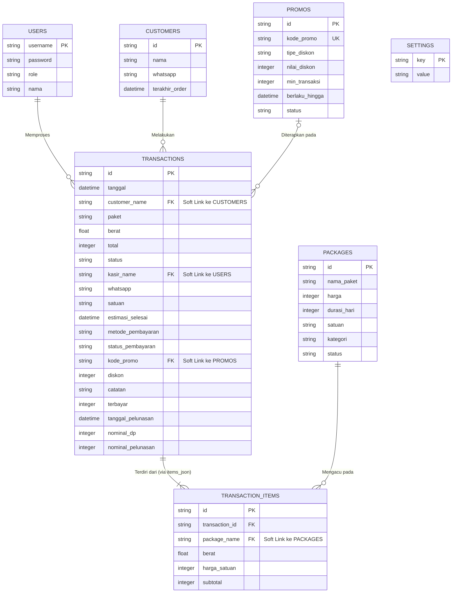

# Dokumentasi Database & Entity Relationship Diagram (ERD) L-Premium POS

Dokumen ini berisi tinjauan struktural (review) arsitektur database berbasis Google Sheets untuk aplikasi L-Premium POS, beserta diagram relasi entitas (ERD) sesuai standar pemodelan Astah UML.

---

## 1. Review Arsitektur Database (Perspektif Senior Developer)

Berdasarkan analisis kode pada `Kode.js` (terutama fungsi `setupDatabase` dan transaksi), berikut adalah review teknis mengenai struktur database saat ini:

### 1.1. Kekuatan (Strengths)
* **Kinerja (Performance):** Penggunaan format JSON (kolom `items_json`) pada tabel `transactions` mengurangi jumlah pemanggilan ke database (I/O) yang sangat mahal di Google Apps Script.
* **Resiliensi Data:** Strategi menggunakan `LockService` dan validasi berlapis di server (misalnya: validasi harga paket & promo tidak mempercayai payload client) sangat baik untuk menjaga integritas data.
* **UUID Implementation:** Menggunakan prefix string dan UUID (seperti `TRX-...`, `CUST-...`, `PKG-...`) sangat tangguh untuk menghindari bentrokan (*collision*) pada sistem multi-user.

### 1.2. Kelemahan & Pelanggaran Normalisasi (Weaknesses)
* **Pelanggaran 1NF (Denormalisasi JSON):**
  Penyimpanan banyak item (paket & berat) dalam kolom tunggal `items_json` melanggar Aturan Bentuk Normal Pertama (1NF). Dalam desain RDBMS yang ketat (seperti di Astah UML), relasi ini seharusnya dipecah menjadi entitas perantara (contoh: `Transaction_Items`). Meskipun demikian, untuk skala Google Sheets, ini adalah kompromi yang valid.
* **Weak Foreign Keys (Integritas Referensial):**
  Saat ini, referensi antar entitas bersifat "Soft Link" menggunakan *Value/Name* alih-alih `ID`.
  * Contoh: Kolom `customer` di `transactions` menyimpan `nama` pelanggan, bukan `customer_id`.
  * Contoh: Kolom `kasir` di `transactions` menyimpan string nama kasir, bukan `user_id`.
  * **Risiko:** Jika terjadi perubahan nama pada `users` atau `customers`, maka riwayat transaksi sebelumnya dapat kehilangan relasinya atau tidak sinkron.
* **Redundansi Data:**
  Banyak kolom di `transactions` bersifat redundan demi keperluan laporan (seperti `paket`, `berat` global, `satuan` global). Ini mempercepat *query* namun memakan lebih banyak kapasitas kolom.

### 1.3. Saran Perbaikan Struktural (Rekomendasi)
* Jika aplikasi ini akan di-scale ke RDBMS murni (seperti MySQL/PostgreSQL), transisikan relasi referensial dari `Nama` ke `ID`.
* Buat tabel `transaction_items` terpisah jika di masa depan pelacakan inventaris per-item dibutuhkan.

---

## 2. Entity Relationship Diagram (ERD)

Diagram berikut disusun dengan standar **Crow's Foot Notation**, yaitu notasi yang digunakan dan didukung secara native oleh sistem pemodelan seperti **Astah UML**.

> **Catatan Pemodelan:** Dalam ERD di bawah ini, entitas `TRANSACTION_ITEMS` digambarkan sebagai entitas konseptual independen sesuai standar arsitektur relasional, meskipun dalam implementasi fisiknya (di `Kode.js`), ia digabung sebagai `items_json` di dalam tabel `transactions`.

### Penjelasan Entitas & Kardinalitas (Sesuai Astah UML)

1. **USERS (Kasir / Admin):**
   * Menyimpan kredensial sistem.
   * **Relasi:** 1 User (1) dapat menangani Banyak (0..*) Transactions. (*One-to-Many*)

2. **CUSTOMERS (Pelanggan):**
   * Menyimpan profil dan kontak pelanggan.
   * **Relasi:** 1 Customer (1) dapat memiliki Banyak (0..*) Transactions. (*One-to-Many*)

3. **PACKAGES (Layanan / Paket):**
   * Katalog layanan (Cuci Setrika, Dry Clean, dll).
   * **Relasi:** 1 Package (1) dapat direferensikan dalam Banyak (0..*) Transaction Items. (*One-to-Many*)

4. **PROMOS (Kode Promosi):**
   * Katalog promo yang berlaku.
   * **Relasi:** 1 Promo (0..1) dapat digunakan pada Banyak (0..*) Transactions. (*One-to-Many*)

5. **TRANSACTIONS (Transaksi Utama):**
   * Header dari nota transaksi.
   * **Relasi:** 1 Transaction (1) memiliki Minimal 1 (1..*) Transaction Items. (*One-to-Many Composition*)

6. **TRANSACTION_ITEMS (Detail Keranjang - Conceptual):**
   * Dalam struktur fisik, tabel ini disimpan di dalam kolom `transactions.items_json`. Namun dalam Astah UML (Logical Data Model), ini harus dipisah agar relasinya terlihat (Many-to-Many resolution antara Transactions & Packages).

7. **SETTINGS (Pengaturan Global):**
   * Entitas mandiri (Key-Value pair) yang tidak memiliki relasi langsung ke entitas manapun secara struktural.
