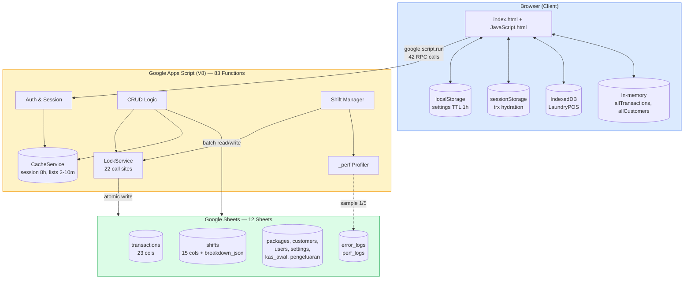
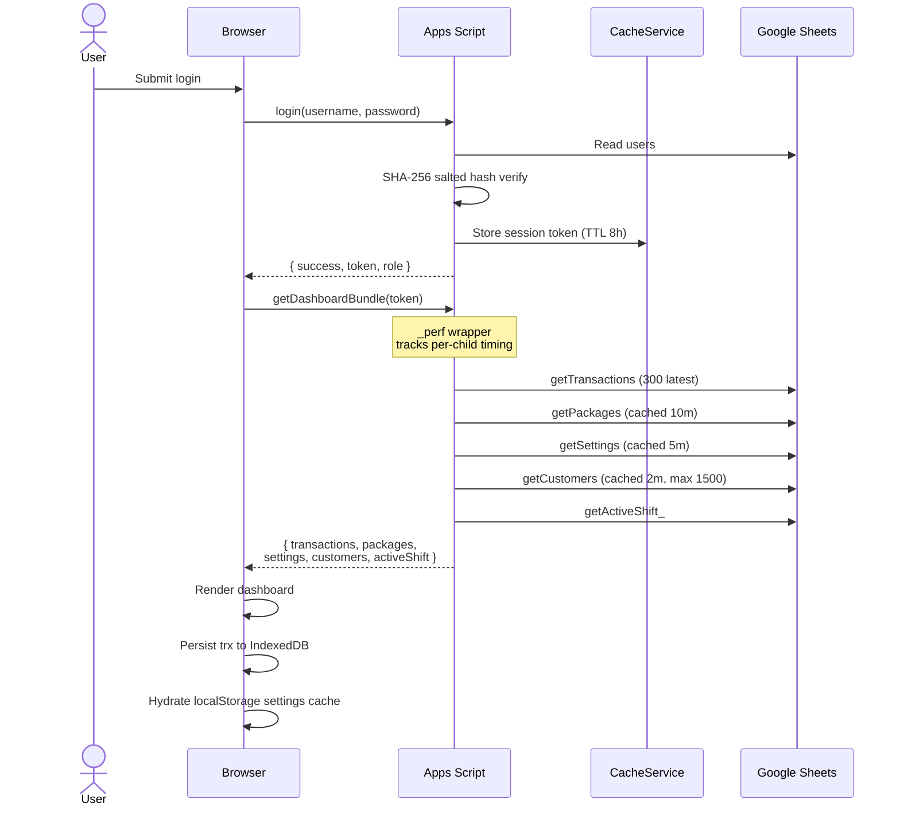
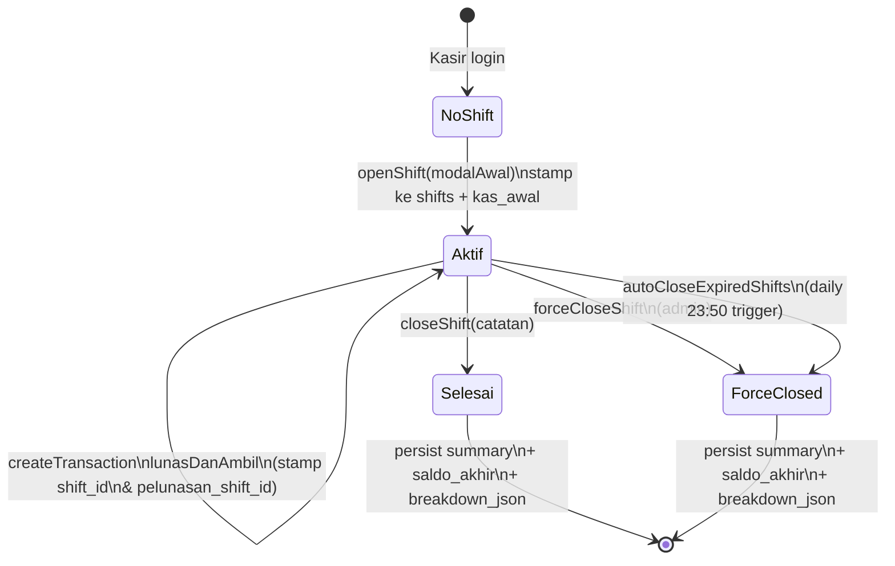
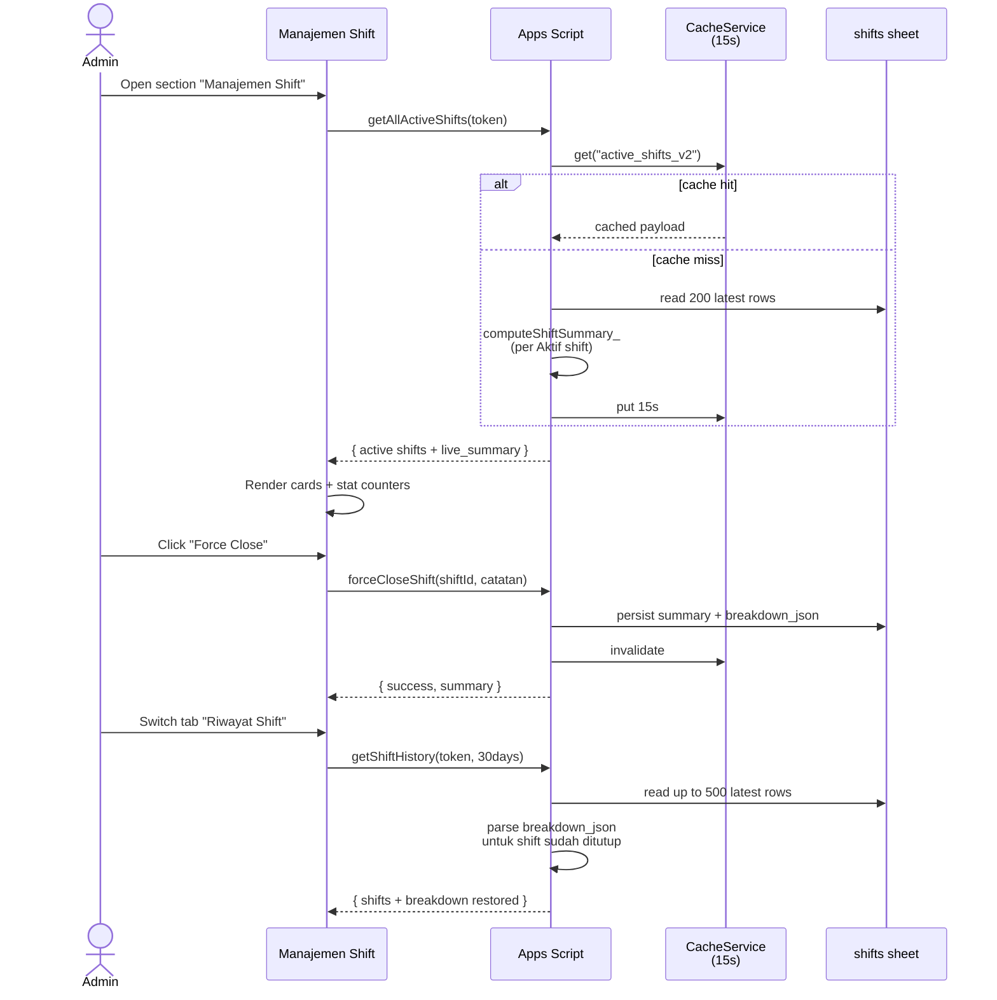

<div align="center">


# Kucucikan Laundry POS

### Cloud-Native Point of Sale untuk Bisnis Laundry Modern

_Sistem kasir end-to-end dengan shift management, profiling instrumentation, incremental sync, dan multi-layer caching — semua di atas Google Apps Script tanpa biaya hosting._

<br />

<!-- GitHub Stats -->
[](https://github.com/nndda-rzn/kucucikan-laundry-migrate/stargazers)
[](https://github.com/nndda-rzn/kucucikan-laundry-migrate/network/members)
[](https://github.com/nndda-rzn/kucucikan-laundry-migrate/commits/main)
[](https://github.com/nndda-rzn/kucucikan-laundry-migrate/issues)
[](https://github.com/nndda-rzn/kucucikan-laundry-migrate/pulls)
[](https://github.com/nndda-rzn/kucucikan-laundry-migrate)

<br />

<!-- Platform & Runtime -->
[](https://script.google.com/)
[](#)
[](https://sheets.google.com/)
[](https://drive.google.com/)
[](#)

<br />

<!-- Frontend & UI -->
[](https://developer.mozilla.org/en-US/docs/Web/HTML)
[](https://developer.mozilla.org/en-US/docs/Web/JavaScript)
[](https://tailwindcss.com/)
[](https://fonts.google.com/)
[](https://fonts.google.com/specimen/Space+Mono)

<br />

<!-- Server-Side GAS Services -->
[](#)
[](#)
[](#)
[](#)
[](#)
[](#)
[](#)

<br />

<!-- Client-Side APIs -->
[](https://developer.mozilla.org/en-US/docs/Web/API/IndexedDB_API)
[](https://developer.mozilla.org/en-US/docs/Web/API/Window/localStorage)
[](https://developer.mozilla.org/en-US/docs/Web/API/Window/sessionStorage)
[](https://developer.mozilla.org/en-US/docs/Web/API/AudioContext)
[](https://developer.mozilla.org/en-US/docs/Web/API/Performance)

<br />

<!-- Libraries & CDN -->
[](https://apexcharts.com/)
[](https://github.com/parallax/jsPDF)
[](https://github.com/simonbengtsson/jsPDF-AutoTable)

<br />

<!-- Build & Tooling -->
[](https://nodejs.org/)
[](https://www.npmjs.com/)
[](https://github.com/google/clasp)
[](https://tailwindcss.com/)
[](https://git-scm.com/)
[](https://github.com/)

<br />

<!-- Status & Meta -->
[](#)
[](#-changelog)
[](#)
[](#-license)
[](#)
[](#-contributing)
[](https://www.conventionalcommits.org/)
[](#)
[](#)
[](#)

<br />

[**Fitur**](#-fitur-utama) ·
[**Arsitektur**](#-arsitektur--alur-data) ·
[**Performance**](#-performance--profiling) ·
[**Skema DB**](#-skema-database) ·
[**API Ref**](#-api-reference) ·
[**Deploy**](#-instalasi--deployment) ·
[**FAQ**](#-faq) ·
[**Changelog**](#-changelog)

</div>

---

## Daftar Isi

- [Tentang Proyek](#-tentang-proyek)
- [Fitur Utama](#-fitur-utama)
- [Tech Stack](#-tech-stack)
- [Arsitektur & Alur Data](#-arsitektur--alur-data)
- [Performance & Profiling](#-performance--profiling)
- [Skema Database](#-skema-database)
- [API Reference](#-api-reference)
- [Instalasi & Deployment](#-instalasi--deployment)
- [Konfigurasi Pasca-Deploy](#-konfigurasi-pasca-deploy)
- [Workflow Pengembangan](#-workflow-pengembangan)
- [Kredensial Default](#-kredensial-default)
- [FAQ](#-faq)
- [Roadmap](#-roadmap)
- [Changelog](#-changelog)
- [Contributing](#-contributing)
- [License](#-license)

---

## Tentang Proyek

**Kucucikan Laundry POS** adalah sistem kasir _end-to-end_ yang mengeliminasi
biaya infrastruktur dengan memanfaatkan ekosistem Google Workspace:

- **Google Sheets** sebagai database relasional (12 sheet)
- **Google Apps Script (V8)** sebagai backend serverless (83 fungsi)
- **Web App URL** sebagai endpoint produksi yang dibagikan ke kasir/admin

### Arsitektur Kode

| Layer | File | Ukuran | Deskripsi |
|-------|------|--------|-----------|
| **Backend** | `Kode.js` | 104 KB | 83 server functions, 2.968 baris |
| **Frontend Logic** | `JavaScript.html` | 272 KB | 50+ client functions, 6.200+ baris |
| **HTML Template** | `index.html` | 184 KB | SPA layout, modals, sections (3.700+ baris) |
| **CSS (Compiled)** | `Tailwind.html` | 74 KB | Tailwind CSS v4.2.3 minified |
| **Custom CSS** | `CSS.html` | 3 KB | Print, a11y, animations, scrollbar |
| **Build Script** | `build-tailwind.js` | 1 KB | Tailwind CLI wrapper |

Cocok untuk UMKM laundry dengan 1–3 kasir aktif yang membutuhkan POS profesional
tanpa biaya berlangganan bulanan, namun tetap menuntut akuntabilitas
(shift management, audit log, auto-backup) dan performa yang terukur
(profiling instrumentation, multi-layer caching, batch operations).

---

## Fitur Utama

<table>
<tr>
<td width="50%" valign="top">

### Manajemen Transaksi
- Kalkulasi otomatis tagihan, diskon, kembalian
- Pembayaran fleksibel: Tunai, Transfer, QRIS
- Sistem DP (Down Payment) dan pelunasan
- Multi-item per transaksi (kiloan + satuan)
- Auto-save draft tiap 5 detik (anti-crash browser)
- Cetak nota digital (thermal-ready 58mm)
- Konfirmasi WhatsApp dengan template kustom
- Status transaksi: Proses → Selesai → Diambil
- Riwayat transaksi dengan filter & search

### Manajemen Pelanggan
- CRUD pelanggan dengan WA ternormalisasi
- Riwayat & total spent per pelanggan
- Auto-suggest saat input transaksi baru
- Badge VIP otomatis untuk pelanggan loyal
- Tracking terakhir order & frekuensi transaksi

### Manajemen Layanan
- Katalog dinamis (kiloan, satuan, kategori)
- Toggle aktif/nonaktif dengan optimistic UI
- Indikator popularitas paket
- Migration kolom otomatis
- Durasi estimasi proses per paket

</td>
<td width="50%" valign="top">

### Shift Management
- Buka shift dengan modal awal kas (otomatis tersinkron ke Manajemen Kas)
- Tutup shift dengan rekap saldo akhir + **breakdown rinci**
  per metode (Tunai/QRIS/Transfer × DP/Pelunasan) dan per kategori
  pengeluaran (Bahan Baku/Operasional/Lain-lain)
- Atribusi pelunasan akurat antar shift
  (kolom `pelunasan_shift_id`)
- **Section "Manajemen Shift" admin-only** dengan tab Shift Aktif
  (live monitoring) & Riwayat Shift, plus stat cards real-time
- **Force-close** oleh admin untuk shift terbengkalai
- **Auto-close** trigger harian pukul 23:50
- Persisted summary + breakdown JSON (kolom 15) — admin bisa
  buka detail historis shift lama tanpa recompute
- Tombol "Hitung Detail" untuk lazy-migrasi shift pre-v2.3
- 15-detik cache pada `getAllActiveShifts` dengan auto-invalidate
  saat open/close/force-close
- Bypass otomatis untuk role admin di flow transaksi

### Dasbor Analitik
- Real-time omzet, antrean, target hari ini
- Multi-cashier sync (auto-refresh 60 detik)
- Pause polling saat tab background → resume on focus
- Tren pendapatan + chart layanan terlaris
- Export laporan CSV / PDF (lazy-loaded)
- Multi-device realtime sync (v2.7+)
- **Manajemen Kas role-aware scope:**
  - Kasir + shift aktif → "Pengeluaran Shift Ini" (window waktu shift)
  - Kasir tanpa shift → form disabled + banner peringatan + tooltip
  - Admin → "Pengeluaran Hari Ini" (lintas shift)
  - Tanggal lalu → read-only riwayat
- **Card Total Penerimaan terhitung otomatis** (v2.6+):
  - Scope shift → akumulasi DP + pelunasan dalam window shift aktif
  - Scope date → DP berdasarkan tanggal transaksi + pelunasan
    berdasarkan `tanggal_pelunasan`
  - Subtitle realtime: `Tunai Rp X · Non-Tunai Rp Y`
  - Auto-refresh setelah `createTransaction` & `lunasDanAmbil`
- Banner edukatif "Uang Awal Otomatis" dari shift aktif
- Estimasi saldo real-time

### Manajemen Shift Admin (v2.3+)
- Section dedicated dengan tab Shift Aktif & Riwayat Shift
- 3 stat cards real-time: Shift Aktif Saat Ini, Total Modal Beredar,
  Penerimaan Live
- **Search & filter** di tab Riwayat (cari nama kasir, filter status)
- **Progressive disclosure** — card detail 2-layer:
  - Layer 1 (default): total per metode + total pengeluaran
  - Layer 2 ("Lihat Rincian Penuh"): DP/Pelunasan per metode +
    breakdown kategori pengeluaran
- Live monitoring per kasir dengan indicator pulse hijau
- Force-close shift dengan modal konfirmasi + catatan wajib
- 15-detik server cache + auto-invalidate

### Aksesibilitas (a11y)
- 9 modal dengan `role="dialog"` + `aria-modal` + `aria-labelledby`
- Decorative icon di-mark `aria-hidden="true"` agar screen reader skip
- WCAG AA contrast — semua label kecil pakai `text-slate-500`
- `focus-visible` outline pada semua interactive elements
- `@media (prefers-reduced-motion: reduce)` — disable semua animasi
- `aria-disabled` + `cursor: not-allowed` + tooltip pada form disabled
- Mobile bottom-nav dengan `aria-label` per tombol
- Focus management saat modal open/close

### Integrasi WhatsApp
- Kirim konfirmasi via `wa.me` URL dengan template kustom
- Placeholder: `{customer}`, `{nota}`, `{paket}`, `{berat}`,
  `{total}`, `{status_pembayaran}`, `{estimasi}`, `{status}`, `{nama_toko}`
- Phone normalization (strip `+`, spaces, dashes)
- Validasi: 10-15 digits

### Administrasi
- Manajemen pegawai (admin/kasir) dengan role-based access
- Pengaturan toko (nama, logo, rekening)
- Template WhatsApp kustom dengan placeholder
- Auto-backup harian ke Google Drive (02:00 WIB)
- Error logging silent ke sheet `error_logs` (auto-rotate 500 row)
- Performance benchmark built-in (`runPerfBenchmark`)
- Profiling instrumentation dengan perf_logs (auto-rotate 1000 row)

### Security
- Token-based session (UUID, TTL 8 jam, rolling refresh)
- Salted hash password (SHA-256) dengan auto-migrasi format lama
- Login rate limit — 5 percobaan gagal → kunci 15 menit
- Admin-only guards via `validateAdminSession_()`
- Server-side trust — total, diskon, status divalidasi ulang di server

</td>
</tr>
</table>

---

## Tech Stack

### Platform & Runtime

| Teknologi | Kegunaan |
|-----------|----------|
| Google Apps Script (V8 Runtime) | Backend serverless — 83 fungsi, 2.968 baris |
| Google Sheets | Database relasional (12 sheet + 2 log sheets) |
| Google Drive | Auto-backup harian (duplikasi spreadsheet) |
| Google Stackdriver | Error logging via Cloud Logging |

### Server-Side GAS Services (7)

| Service | Method | Kegunaan |
|---------|--------|----------|
| `SpreadsheetApp` | `openById()`, `getSheetByName()`, `insertSheet()`, `copy()` | Primary database access |
| `CacheService` | `getScriptCache()`, `get()`, `put()`, `remove()` | Cross-execution caching (6hr max TTL) |
| `LockService` | `getScriptLock()`, `tryLock()`, `releaseLock()` | Concurrency control (22 call sites) |
| `PropertiesService` | `getScriptProperties()`, `getProperty()`, `setProperty()` | Persistent config (DB_ID, cache versions) |
| `HtmlService` | `createTemplateFromFile()`, `createHtmlOutputFromFile()` | Serve HTML SPA via Web App |
| `ScriptApp` | `getProjectTriggers()`, `newTrigger()`, `deleteTrigger()` | Time-driven triggers (backup, warmup, auto-close) |
| `Utilities` | `getUuid()`, `computeDigest()`, `formatDate()` | UUID, SHA-256 hash, date formatting |

### Frontend & UI

| Teknologi | Versi | Kegunaan |
|-----------|-------|----------|
| HTML5 | - | SPA template dengan GAS templating (`<?= ?>` scriptlets) |
| JavaScript ES2020 | - | Client-side logic (50+ functions, 6.200+ baris) |
| Tailwind CSS | v4.2.3 | Utility-first CSS framework (74KB compiled) |
| Plus Jakarta Sans | 400-800 | Primary body font (Google Fonts) |
| Space Mono | 400, 700 | Monospace receipt font (Google Fonts) |

### Client-Side Web APIs (18+)

| API | Kegunaan |
|-----|----------|
| `google.script.run` | RPC ke GAS backend (42 panggilan) |
| `IndexedDB` | Persistent transaction cache ("LaundryPOS", store "transactions") |
| `localStorage` | Session, settings, draft, packages cache (4 keys) |
| `sessionStorage` | Transaction fallback cache (`trx_cache_v1`) |
| `AudioContext` / `webkitAudioContext` | Notification beep (2-tone: 800Hz + 1200Hz) |
| `performance.now()` | Client-side RPC profiling (`trackedRun()`) |
| `URL.createObjectURL()` | CSV export download |
| `Blob` | CSV file generation dengan BOM (Excel compatible) |
| `window.print()` | Receipt printing (thermal 58mm via CSS `@media print`) |
| `requestAnimationFrame` | UI animation smoothness |
| `document.getElementById()` | DOM manipulation |
| `document.createElement()` | Dynamic script loading, toast notifications |
| `document.addEventListener()` | Click-outside-close for dropdowns |
| `JSON.parse()` / `JSON.stringify()` | Cache serialization |
| `Date` / `toLocaleDateString()` | Date formatting (`id-ID` locale) |
| `Intl` | Rupiah formatting via `toLocaleString("id-ID")` |
| `setTimeout` / `setInterval` | Debouncing, auto-refresh, session checks |
| `Promise` | IndexedDB async wrappers |

### Libraries & CDN (Lazy-Loaded)

| Library | Versi | CDN URL | Fungsi |
|---------|-------|---------|--------|
| ApexCharts | latest | `cdn.jsdelivr.net/npm/apexcharts` | Charts & visualisasi data (~250KB) |
| jsPDF | 2.5.1 | `cdnjs.cloudflare.com/ajax/libs/jspdf/2.5.1/jspdf.umd.min.js` | PDF export |
| jsPDF-AutoTable | 3.5.28 | `cdnjs.cloudflare.com/ajax/libs/jspdf-autotable/3.5.28/jspdf.plugin.autotable.min.js` | Table export ke PDF (~150KB total) |

### Build & Tooling

| Tool | Versi | Kegunaan |
|------|-------|----------|
| Node.js | 18+ | Build runtime |
| npm | - | Package manager |
| @tailwindcss/cli | 4.2.3 | Tailwind CSS compilation |
| clasp | - | Google Apps Script CLI (push/deploy) |
| Git | - | Version control |
| GitHub | - | Repository hosting |

### Caching Strategy (4-Layer)

| Layer | Media | TTL | Data |
|-------|-------|-----|------|
| **Server CacheService** | GAS ScriptCache | 8h / 2-10m | Session (8h), customers (2m), packages (10m), price map (5m), settings (5m), reports (30s), kas (30s) |
| **Memory** | Per-execution | Single request | Price map per execution |
| **Client RAM** | JavaScript | 1-2m | Transactions (1m), customers (2m) |
| **Persistent Client** | localStorage + sessionStorage + IndexedDB | 1h / session | Settings (1h), draft (1h), packages (5m), transactions (IndexedDB persistent) |

### localStorage Keys

| Key | TTL | Data |
|-----|-----|------|
| `l_premium_session_v3` | 6h | User session (user, token, expiry) |
| `l_premium_settings_cache` | 1h | App settings cache |
| `l_premium_draft` | 1h | Transaction draft auto-save |
| `l_premium_packages_cache` | 5m | Packages persistent cache |

---

## Arsitektur & Alur Data

### File Architecture

```
├── Kode.js              (104 KB) ── Server: 83 functions, 2.968 baris
├── JavaScript.html      (272 KB) ── Client: 50+ functions, 6.200+ baris
├── index.html           (184 KB) ── SPA template, modals, sections
├── Tailwind.html         (74 KB) ── Compiled Tailwind CSS (minified)
├── CSS.html               (3 KB) ── Custom styles, print, a11y, animations
├── appsscript.json             ── GAS config (V8, Stackdriver, Web App)
├── package.json                ── npm config (tailwindcss, @tailwindcss/cli)
├── build-tailwind.js           ── Build pipeline (Tailwind CLI → Tailwind.html)
└── input.css                   ── Tailwind source (@import "tailwindcss")
```

### High-Level Architecture



### Login & Dashboard Bundle Flow



### Shift Lifecycle



### Admin Shift Management Flow (v2.3)



### Manajemen Kas Scope Resolution (v2.4)


---

## Performance & Profiling

### Pilar Optimasi

#### Performance
- **`getDashboardBundle`** — 1 RPC menggantikan 5 panggilan serial
  (transactions, packages, settings, customers, activeShift),
  hemat ~2–8 detik per login
- **Warmup trigger** — `setupWarmupTrigger` pasang time-based trigger
  setiap 5 menit yang menjaga V8 engine panas. Cold start 3–8s → ~500ms
- **Range-bounded reads** — semua hot path (`getCustomers`, `getKasHarian`,
  `computeShiftSummary_`, `getTransactions`) hanya membaca window
  yang relevan, bukan full sheet
- **Price map cache** — `createTransaction` lookup harga via cached
  map id→harga (memory + CacheService 5m), hemat 200–400ms per transaksi
- **Batch sheet writes** — `setValues([rows])` menggantikan multiple
  `setValue()`, percepat tulis 400–600%
- **Persisted shift summary** — sheet `shifts` menyimpan
  `total_pengeluaran`, `saldo_akhir`, dan **`breakdown_json`** (kolom 15)
  saat close, jadi `getShiftHistory` tidak recompute untuk shift
  yang sudah ditutup
- **Active shifts cache 15s** — `getAllActiveShifts` hasil di-cache
  CacheService 15 detik dengan auto-invalidate hooks pada
  open/close/forceClose; aman untuk monitoring polling agresif
- **Lazy migration** — endpoint `recomputeShiftBreakdown` admin-only
  untuk menghitung & persist breakdown shift lama on-demand
- **Lazy-load** ApexCharts (~250KB) + jsPDF (~150KB) hanya saat tab
  Laporan pertama dibuka, hemat ~400KB pada initial load
- **4-layer caching:**
  - **Server CacheService** — sesi (8h), customers (2m), packages (10m),
    price map (5m), settings (5m), **report data (30s)**, **kas periode (30s)**,
    **kas harian (30s)**
  - **Memory cache** — price map per execution
  - **Client RAM** — transactions (1m), customers (2m)
  - **Persistent client** — sessionStorage (trx hydration),
    localStorage (settings 1h), **IndexedDB (`trxDB`) untuk persistent
    transactions cache** — page reload instan tanpa fetch server
- **Incremental sync (ETag-style)** — `getTransactions(token, clientHash)`
  bandingkan hash payload server vs client; jika sama, kembalikan
  `{ noChange: true }` saja — bandwidth polling turun ~70%
- **Report pre-aggregation** — `getReportAndKasData` menghitung
  byDate, byPackage, byCustomer, byPaymentMethod di server, client
  hanya render (eliminasi loop O(n) di browser). Load time laporan:
  1.3–4.8s → **0.8–1.5s** (first load), **<200ms** (cache hit)
- **Progressive dashboard bootstrap** — `getDashboardBundle` kirim
  inti dulu (transactions, packages, settings, activeShift), customers
  dimuat asynchronous → first meaningful paint lebih cepat 30–50%
- **Adaptive polling** — interval auto-tuning **30s saat user aktif**
  (click/keypress/scroll terdeteksi 60s terakhir) vs **120s saat idle**
- **Smart polling** — auto-refresh pause saat
  `document.visibilityState === "hidden"`, resume on visibility change.
  Cakupan polling: `section-overview`, `section-history`,
  `section-kas`, dan `section-shift` (admin only) — multi-device sync
  tanpa refresh manual

#### Profiling Built-In
Sistem hadir dengan instrumentasi siap pakai untuk diagnosa lambatnya
request tanpa perlu DevTools eksternal:

```js
// Server-side: jalankan dari Apps Script Editor (admin only)
runPerfBenchmark(token)
// → mengembalikan map { fnName: { ms, ok, size } } untuk semua hot path

// Client-side: dari DevTools console
perfStats()    // tabel p50/p95/max/avg per fungsi
perfClear()    // reset log

// Disable saat tidak diperlukan
disablePerfLogging()           // server (PropertiesService flag)
window.PERF_OFF = true         // client
```

Server `_perf()` otomatis log ke `console.log()` (visible di Stackdriver
Executions) dan sample 1 dari 5 call ke sheet `perf_logs` untuk audit.

#### Reliability
- **LockService** di semua write kritis (createTransaction,
  lunasDanAmbil, openShift, closeShift, forceCloseShift,
  autoCloseExpiredShifts) — 22 call sites
- **Defensive setupDashboard** dengan per-blok try/catch — dashboard
  tetap muncul walau ada satu fungsi error
- **3-tier fallback** — Dashboard loads: FastBundle → full bundle → individual calls
- **Silent error logging** ke sheet `error_logs` untuk audit
  pasca-insiden (auto-prune 500 row)
- **Auto-backup harian** ke Drive pukul 02:00
- **Auto-close shift harian** pukul 23:50 sebagai fail-safe
- **Double-submit prevention** — `isSubmitting` flag + `setBtnLoading()` helper
- **Loading state** — Depth-tracked loading indicator dengan 15s timeout warning

#### Security
- **Token-based session** dengan UUID, TTL 8 jam, rolling refresh
- **Salted hash password** (SHA-256) dengan auto-migrasi format lama saat login
- **Login rate limit** — 5 percobaan gagal mengunci 15 menit
- **Admin-only guards** via `validateAdminSession_()` di endpoint
  sensitif (`deleteTransaction`, `forceCloseShift`, `getShiftHistory`,
  `getAllActiveShifts`, `recomputeShiftBreakdown`, `getUsersList`,
  `runPerfBenchmark`)
- **DB_ID** di Script Properties (bukan hardcoded) dengan auto-migrasi
- **Server-side trust** — total, diskon, status divalidasi ulang di
  server, mencegah manipulasi DevTools

#### Maintainability
- **LF-only line endings** dipaksa via `.gitattributes` — mencegah
  parser GAS pecah saat menerima CRLF dalam inline `<script>`
- **`.claspignore`** mengecualikan file debug & temp dari deployment
- **Modular helpers** — `computeShiftSummary_()`, `getPackagePriceMap_()`,
  `_perf()`, `setBtnLoading()`, `renderListSkeleton()`, `applyKasScope()`
  dipakai lintas hot path
- **Migration scripts** — `setupDatabase()` idempoten dengan auto-add
  kolom baru tanpa data loss

---

## Skema Database

Sheet otomatis dibuat & dimigrasi oleh `setupDatabase()`. Klik untuk
expand detail kolom.

<details>
<summary><b>Sheet: <code>users</code></b></summary>

| Kolom | Tipe | Keterangan |
|-------|------|------------|
| username | string | Primary key (case-insensitive) |
| password | string | Salted hash format `salt:hash` |
| role | enum | `admin` / `kasir` |
| nama | string | Display name |

</details>

<details>
<summary><b>Sheet: <code>packages</code></b></summary>

| Kolom | Tipe | Keterangan |
|-------|------|------------|
| id | UUID | Primary key |
| nama_paket | string | Nama layanan |
| harga | int | Tarif per satuan |
| durasi_hari | int | Estimasi proses (hari) |
| satuan | string | Kg / Pcs / Set |
| kategori | string | Tag pengelompokan |
| status | enum | `Aktif` / `Nonaktif` |

</details>

<details>
<summary><b>Sheet: <code>transactions</code> (23 kolom)</b></summary>

| # | Kolom | Tipe | Keterangan |
|---|-------|------|------------|
| 1 | id | UUID | Primary key |
| 2 | tanggal | ISO datetime | Waktu input transaksi |
| 3 | customer | string | Nama pelanggan |
| 4 | paket | string | Layanan utama (legacy single-item) |
| 5 | berat | float | Berat total (legacy) |
| 6 | total | int | Grand total |
| 7 | status | enum | `Proses`/`Selesai`/`Diambil` |
| 8 | kasir | string | Username kasir yang menginput |
| 9 | whatsapp | string | Nomor WA pelanggan |
| 10 | satuan | string | Satuan default |
| 11 | estimasi_selesai | ISO datetime | Target selesai |
| 12 | metode_pembayaran | string | Tunai/Transfer/QRIS |
| 13 | status_pembayaran | enum | `Lunas`/`Belum Lunas` |
| 14 | metode_pelunasan | string | Diisi saat pelunasan |
| 15 | _(reserved)_ | — | — |
| 16 | catatan | string | Catatan kasir |
| 17 | terbayar | int | Akumulasi pembayaran |
| 18 | items_json | JSON | Multi-item array |
| 19 | tanggal_pelunasan | ISO datetime | Waktu pelunasan |
| 20 | nominal_dp | int | Down payment |
| 21 | nominal_pelunasan | int | Sisa pelunasan |
| 22 | **shift_id** | UUID | FK → shifts.id (saat dibuat) |
| 23 | **pelunasan_shift_id** | UUID | FK → shifts.id (saat dilunasi) |

</details>

<details>
<summary><b>Sheet: <code>shifts</code> (15 kolom)</b></summary>

| # | Kolom | Tipe | Keterangan |
|---|-------|------|------------|
| 1 | id | UUID | Primary key |
| 2 | kasir | string | Username |
| 3 | nama_kasir | string | Display name |
| 4 | waktu_mulai | ISO datetime | Buka shift |
| 5 | waktu_selesai | ISO datetime | Tutup shift |
| 6 | modal_awal | int | Kas awal saat buka |
| 7 | total_transaksi | int | Total nilai trx (persisted) |
| 8 | total_tunai | int | Tunai diterima (persisted) |
| 9 | total_non_tunai | int | Non-tunai diterima (persisted) |
| 10 | jumlah_order | int | Hitung order (persisted) |
| 11 | status | enum | `Aktif`/`Selesai`/`Force-Closed` |
| 12 | catatan | string | Catatan tutup shift |
| 13 | total_pengeluaran | int | Pengeluaran shift (persisted) |
| 14 | saldo_akhir | int | modal + tunai − pengeluaran |
| 15 | **breakdown_json** | JSON | Breakdown rinci per metode (Tunai/QRIS/Transfer × DP/Pelunasan) & per kategori pengeluaran (persisted v2.3+) |

Format `breakdown_json`:
```json
{
  "breakdownMetode": {
    "Tunai":    { "dp": 50000, "pelunasan": 30000, "total": 80000, "count": 3 },
    "QRIS":     { "dp": 0,     "pelunasan": 0,     "total": 0,     "count": 0 },
    "Transfer": { "dp": 0,     "pelunasan": 0,     "total": 0,     "count": 0 },
    "Lainnya":  { "dp": 0,     "pelunasan": 0,     "total": 0,     "count": 0 }
  },
  "breakdownPengeluaran": {
    "Bahan Baku":  { "jumlah": 12000, "count": 1 },
    "Operasional": { "jumlah": 0,     "count": 0 },
    "Lain-lain":   { "jumlah": 0,     "count": 0 }
  },
  "totalDp": 50000,
  "totalPelunasan": 30000
}
```

</details>

<details>
<summary><b>Sheet pendukung lainnya</b></summary>

- **`settings`** — `key`, `value` (config aplikasi)
- **`customers`** — `id`, `nama`, `whatsapp`, `terakhir_order`
- **`kas_awal`** — `tanggal`, `nominal`, `kasir`
- **`pengeluaran`** — `id`, `tanggal`, `keterangan`, `kategori`,
  `jumlah`, `kasir`
- **`error_logs`** — `Waktu`, `Fungsi`, `Pesan`, `Context`
  (auto-rotate 500 row)
- **`perf_logs`** — `timestamp`, `fn`, `ms`, `ok`
  (auto-rotate 1000 row)

</details>

---

## API Reference

Sistem menyediakan **83 server functions** yang dipanggil dari client
via `google.script.run`. Klik untuk expand per kategori.

<details>
<summary><b>Authentication & Session (6 functions)</b></summary>

| Function | Akses | Kegunaan |
|----------|-------|----------|
| `login(username, password)` | Public | Login dengan rate limiting (5 attempts → 15min lock) |
| `validateSession_(token)` | Internal | Validasi session token via CacheService |
| `validateAdminSession_(token)` | Internal | Validasi admin-only session |
| `computeHash(rawPassword)` | Internal | SHA-256 hash computation |
| `hashPassword(password)` | Internal | Salted password hash (format: `salt:hash`) |
| `verifyPassword(input, db)` | Internal | Verify dengan backward compat |

</details>

<details>
<summary><b>Transaction Management (6 functions)</b></summary>

| Function | Akses | Kegunaan |
|----------|-------|----------|
| `getTransactions(token, clientHash)` | Auth | Get with ETag incremental sync (300 row limit) |
| `createTransaction(token, data)` | Auth | Create (with LockService) |
| `updateTransactionStatus(token, id, status)` | Auth | Update status (Proses/Selesai/Diambil) |
| `lunasDanAmbil(token, id, metode)` | Auth | Mark paid+collected |
| `deleteTransaction(token, id)` | Admin | Delete transaction |
| `saveOrUpdateCustomer(kasir, nama, wa, date)` | Auth | Upsert customer on transaction |

</details>

<details>
<summary><b>Customer Management (4 functions)</b></summary>

| Function | Akses | Kegunaan |
|----------|-------|----------|
| `getCustomers(token)` | Auth | Get (cached 2m, max 1500) |
| `addCustomerData(token, nama, wa)` | Auth | Add customer |
| `updateCustomerData(token, id, nama, wa)` | Auth | Update customer |
| `deleteCustomerData(token, id)` | Auth | Delete customer |

</details>

<details>
<summary><b>Package Management (5 functions)</b></summary>

| Function | Akses | Kegunaan |
|----------|-------|----------|
| `getPackages(token)` | Auth | Get (cached 10m) |
| `addPackage(token, ...)` | Admin | Add package |
| `updatePackage(token, id, ...)` | Admin | Update package |
| `updatePackageStatus(token, id, status)` | Admin | Toggle status (Aktif/Nonaktif) |
| `deletePackage(token, id)` | Admin | Delete package |

</details>

<details>
<summary><b>Settings (2 functions)</b></summary>

| Function | Akses | Kegunaan |
|----------|-------|----------|
| `getSettings()` | Public | Get (cached 6h) |
| `saveSettingsConfig(token, dataObj)` | Admin | Save settings |

</details>

<details>
<summary><b>Cash Management (5 functions)</b></summary>

| Function | Akses | Kegunaan |
|----------|-------|----------|
| `saveUangAwal(token, nominal, dateStr)` | Auth | Save opening cash |
| `getKasHarian(token, tanggalStr)` | Auth | Get daily report (scope-aware: shift/date/none) |
| `savePengeluaran(token, keterangan, kategori, jumlah, dateStr)` | Auth | Save expense |
| `deletePengeluaran(token, id)` | Auth | Delete expense |
| `getKasPeriode(token, start, end)` | Admin | Get period report |

</details>

<details>
<summary><b>Shift Management (12 functions)</b></summary>

| Function | Akses | Kegunaan |
|----------|-------|----------|
| `openShift(token, modalAwal)` | Auth | Open new shift |
| `closeShift(token, shiftId, catatan)` | Auth | Close shift with breakdown |
| `forceCloseShift(token, shiftId, catatan)` | Admin | Admin force-close shift |
| `getActiveShift_(username)` | Internal | Get active shift (memory+ScriptCache) |
| `getActiveShiftAPI(token)` | Auth | API wrapper for active shift |
| `getAllActiveShifts(token)` | Admin | Get all active shifts (cached 15s) |
| `getShiftHistory(token, start, end)` | Admin | Get shift history (500 row limit) |
| `computeShiftSummary_(shiftId, modalAwal)` | Internal | Compute shift summary (cached) |
| `recomputeShiftBreakdown(token, shiftId)` | Admin | Recompute old shift breakdown |
| `autoCloseExpiredShifts()` | Trigger | Time-trigger auto-close at 23:50 |
| `_flushAllShiftSummaryCache_()` | Internal | Flush all shift summary caches |
| `invalidateShiftSummaryCache_(shiftId)` | Internal | Invalidate shift cache |

</details>

<details>
<summary><b>Dashboard & Reports (7 functions)</b></summary>

| Function | Akses | Kegunaan |
|----------|-------|----------|
| `getDashboardBundle(token)` | Auth | Full bundle (tx+pkg+settings+cust+shift) |
| `getDashboardBundleFast(token, skipPackages)` | Auth | Fast bundle (cached data only) |
| `getReportData(token, start, end)` | Admin | Report data |
| `getReportAndKasData(token, start, end)` | Admin | Combined report+cass (optimization) |
| `aggregateReportData_(reportData, ...)` | Internal | Server-side report pre-aggregation |
| `getKasHarian(token, tanggalStr)` | Auth | Cash report with scope resolution |
| `getKasPeriode(token, start, end)` | Admin | Cash report by period |

</details>

<details>
<summary><b>User Management (3 functions)</b></summary>

| Function | Akses | Kegunaan |
|----------|-------|----------|
| `getUsersList(token)` | Admin | List all users |
| `saveUserAccount(token, isEdit, ...)` | Admin | Create/update user account |
| `deleteUserAccount(token, username)` | Admin | Delete user (cannot delete "admin") |

</details>

<details>
<summary><b>Performance & Utilities (10 functions)</b></summary>

| Function | Akses | Kegunaan |
|----------|-------|----------|
| `_perf(name, fn)` | Internal | Performance profiling wrapper |
| `runPerfBenchmark(token)` | Admin | Run performance benchmark |
| `disablePerfLogging()` | Admin | Disable perf logging |
| `enablePerfLogging()` | Admin | Enable perf logging |
| `logError(funcName, message, context)` | Internal | Error logging (console + error_logs sheet) |
| `generateId(prefix)` | Internal | UUID generation (`prefix-timestamp-random`) |
| `warmup()` | Trigger | Cold start prevention |
| `setupAllTriggers()` | Admin | Install all triggers at once |
| `dailyBackup()` | Trigger | Execute daily spreadsheet backup |
| `setupDatabase()` | Admin | Create all sheets + migrations (idempotent) |

</details>

---

## Instalasi & Deployment

### Prasyarat

- [Node.js](https://nodejs.org/) ≥ 18.x dan npm
- Akun Google dengan akses Apps Script
- _(Opsional)_ Tailwind CLI untuk rebuild CSS

### Quick Start

```bash
# 1. Clone repository
git clone https://github.com/nndda-rzn/kucucikan-laundry-migrate.git
cd kucucikan-laundry-migrate

# 2. Install clasp global
npm install -g @google/clasp

# 3. Login ke Google
clasp login

# 4a. Hubungkan ke project Apps Script existing
clasp clone <YOUR_SCRIPT_ID>

# 4b. ATAU buat project baru
clasp create --type webapp --title "Kucucikan Laundry POS"

# 5. Push source ke server
clasp push

# 6. Buat versi deployment baru (WAJIB untuk URL /exec)
clasp deploy
```

### Build Tailwind (Opsional)

```bash
npm install -D @tailwindcss/cli
node build-tailwind.js
clasp push
```

---

## Konfigurasi Pasca-Deploy

Buka editor (`clasp open`) lalu jalankan fungsi berikut **satu kali**:

| Function | Tujuan | Frekuensi |
|----------|--------|-----------|
| `setupDatabase` | Inisialisasi sheet & migrasi kolom (idempoten) | Sekali |
| `setupAllTriggers` | Pasang warmup + auto-close shift + auto-backup | Sekali |
| _(opsional)_ `runPerfBenchmark` | Diagnose latency hot paths | On-demand |

> **Pertama kali Run** akan meminta authorization Google untuk akses
> Sheets, Drive, dan ScriptApp triggers. Klik _Review permissions_ →
> pilih akun → _Allow_.

### Trigger yang Terpasang oleh `setupAllTriggers`

| Trigger | Frekuensi | Fungsi |
|---------|-----------|--------|
| `warmup` | Tiap 5 menit | Cegah V8 cold start (3-8s → ~500ms) |
| `autoCloseExpiredShifts` | Harian 23:50 | Tutup shift terbengkalai |
| `dailyBackup` | Harian 02:00 | Duplikasi DB ke Drive |

---

## Workflow Pengembangan

```bash
# Edit file lokal di IDE favorit
code .

# Sync ke GAS
clasp push

# Buat versi deployment baru (untuk URL /exec)
clasp deploy

# Atau test di /dev URL — selalu pakai HEAD terbaru tanpa versioning
clasp open
# → Deploy → Test deployments → ambil URL
```

> **Penting:** `clasp push` saja **tidak** akan meng-update URL `/exec`
> production — versi deployment baru harus dibuat agar GAS menyajikan
> kode terbaru. Gunakan `/dev` URL untuk iterasi cepat saat development.

### Profiling Saat Investigasi Lambat

```bash
# Server-side: jalankan dari editor
runPerfBenchmark   # admin token diperlukan

# Atau cek log Executions:
# Apps Script Editor → Executions → filter "PERF"
# → akan tampil [PERF][getDashboardBundle] 1234ms beserta child timings

# Cek sheet perf_logs untuk sample histori
# (1 dari 5 call disimpan, auto-rotate 1000 row)
```

```js
// Client-side: DevTools console
perfStats()    // p50/p95/max per RPC
perfClear()    // reset
```

---

## Kredensial Default

Setelah `setupDatabase()` pertama kali dijalankan:

| Username | Password | Role |
|----------|----------|------|
| `admin` | `admin123` | admin |
| `kasir` | `kasir123` | kasir |

> **Wajib ganti password** setelah login pertama via menu
> **Manajemen Pegawai**.

---

## FAQ

| Question | Answer |
|----------|--------|
| **Apakah benar-benar gratis?** | Ya. Zero hosting cost — berjalan 100% di Google Workspace tanpa server eksternal |
| **Berapa kasir yang bisa aktif?** | 1–3 kasir aktif secara bersamaan dengan multi-device sync |
| **Bagaimana cara backup data?** | Auto-backup harian ke Google Drive pukul 02:00 WIB. Manual: jalankan `dailyBackup()` |
| **Apakah bisa offline?** | Tidak. Koneksi internet diperlukan untuk sinkronisasi dengan Google Sheets |
| **Bagaimana cara update versi?** | `clasp push` lalu `clasp deploy` |
| **Apakah ada support?** | Issues via GitHub, PRs welcome |
| **Berapa banyak transaksi yang bisa ditangani?** | Hingga ribuan transaksi (300 terbaru di-cache, sisanya di sheet) |
| **Apakah data aman?** | Ya. Token-based auth (8h TTL), salted SHA-256 hash, rate limiting, admin-only guards |
| **Bisa digunakan di mobile?** | Ya. Responsive design dengan bottom navigation, touch-friendly |
| **Apakah ada cetak struk?** | Ya. Thermal receipt 58mm via `window.print()` dengan CSS print media query |
| **Apa itu breakdown_json?** | JSON persisted di sheet shifts (kolom 15) yang menyimpan rincian per metode pembayaran & kategori pengeluaran — admin bisa lihat detail historis tanpa recompute |
| **Apa itu ETag-style incremental sync?** | Client mengirim hash data ke server. Jika sama, server hanya mengembalikan `{ noChange: true }` — bandwidth polling turun ~70% |

---

## Roadmap

- [ ] Multi-cabang (multi-spreadsheet sync)
- [ ] Real-time push via Apps Script Sheets API webhook
- [ ] Loyalty point & redemption system
- [ ] Integrasi payment gateway (Midtrans/Xendit) untuk QRIS dinamis
- [ ] Mobile-first PWA dengan offline mode
- [ ] Multi-bahasa (EN/ID)
- [ ] Audit trail per transaksi (siapa edit kapan)
- [ ] Pre-aggregated daily stats sheet untuk dashboard instant
- [ ] Service worker caching untuk static asset
- [ ] Bulk migration command untuk semua shift legacy ke breakdown_json
- [ ] Export PDF/Excel rekap shift per kasir & per periode

---

## Troubleshooting

<details>
<summary><b>Error: "Exception: You do not have permission to call SpreadsheetApp.openById"</b></summary>

**Penyebab:** Script belum diberi akses ke spreadsheet target.

**Solusi:**
1. Buka Apps Script Editor
2. Jalankan fungsi `doGet()` atau `setupDashboard()` sekali secara manual
3. Autorisasi akses saat diminta pop-up OAuth
4. Refresh web app

</details>

<details>
<summary><b>Error: "Service invoked too many times in a short time"</b></summary>

**Penyebab:** Hit quota limit GAS (100 req/detik atau 6 menit exec time/hari free tier).

**Solusi:**
- Tunggu 1–5 menit sebelum retry
- Kurangi frekuensi polling (ubah `POLL_INTERVAL` dari 60s ke 120s)
- Aktifkan incremental sync (sudah default di v2.9+)
- Upgrade ke Google Workspace (quota 20x lipat)

</details>

<details>
<summary><b>Session Expired / Token Invalid</b></summary>

**Penyebab:** Token session habis (TTL 8 jam) atau Script Properties corrupt.

**Solusi:**
1. Logout dan login ulang
2. Jika masih error, buka Apps Script Editor → jalankan `clearAllSessions()` di console
3. Clear browser cookies untuk domain script.google.com

</details>

<details>
<summary><b>Data Tidak Sinkron / Card Transaksi Stuck</b></summary>

**Penyebab:** Cache client/server tidak match atau LockService timeout.

**Solusi:**
1. Hard refresh browser (`Ctrl+Shift+R` / `Cmd+Shift+R`)
2. Buka DevTools console, jalankan: `localStorage.clear(); location.reload();`
3. Jika masih stuck, admin bisa force-invalidate cache via Apps Script: `CacheService.getScriptCache().removeAll(['transactions', 'customers', 'packages'])`

</details>

<details>
<summary><b>Shift Tidak Bisa Di-Close (Error 500)</b></summary>

**Penyebab:** Ada row duplikat di sheet `shifts` atau breakdown_json rusak.

**Solusi:**
1. Cek sheet `shifts`, cari row dengan `shift_id` sama dan status `Aktif` > 1
2. Hapus duplikat secara manual (keep yang terbaru)
3. Jalankan `recomputeShiftBreakdown(shiftId)` dari Apps Script console

</details>

<details>
<summary><b>CRLF Line Ending Breaks Inline Script</b></summary>

**Penyebab:** Git checkout convert LF → CRLF, GAS parser gagal parse `<script>` multiline.

**Solusi:**
- Sudah fixed via `.gitattributes` (`* text=auto eol=lf`)
- Manual: `git config core.autocrlf false` → `git checkout -- .`

</details>

<details>
<summary><b>WhatsApp Link Tidak Berfungsi di iOS</b></summary>

**Penyebab:** iOS Safari tidak auto-encode URL params.

**Solusi:**
- Sudah fixed di v2.7+ dengan `encodeURIComponent()` wrapper
- Fallback: copy link manual, paste di WhatsApp

</details>

---

## Script Properties Configuration

Script Properties menyimpan config global via `PropertiesService.getScriptProperties()`. Set via Apps Script Editor → **Project Settings → Script Properties**.

| Key | Type | Required | Default | Keterangan |
|-----|------|----------|---------|------------|
| `DB_ID` | string | ✅ Yes | — | Spreadsheet ID (dari URL `https://docs.google.com/spreadsheets/d/{DB_ID}/`) |
| `PERF_ENABLED` | boolean | ❌ No | `false` | Toggle performance logging ke sheet `perf_logs` dan Stackdriver |
| `BACKUP_FOLDER_ID` | string | ❌ No | root | Google Drive folder ID untuk auto-backup harian |
| `WHATSAPP_TEMPLATE_ENABLED` | boolean | ❌ No | `true` | Toggle WhatsApp quick link dengan template message |
| `SESSION_TTL_HOURS` | number | ❌ No | `8` | Durasi session token sebelum expire (1–24 jam) |
| `LOGIN_RATE_LIMIT_MINUTES` | number | ❌ No | `15` | Durasi lockout setelah 5x login gagal |
| `CACHE_TTL_TRANSACTIONS` | number | ❌ No | `300` | Cache TTL (detik) untuk `getTransactions` |
| `CACHE_TTL_CUSTOMERS` | number | ❌ No | `600` | Cache TTL (detik) untuk `getCustomers` |
| `CACHE_TTL_PACKAGES` | number | ❌ No | `3600` | Cache TTL (detik) untuk `getPackages` |
| `MAX_TRANSACTIONS_CACHE` | number | ❌ No | `300` | Jumlah max transaksi terbaru yang di-cache |

**Contoh Setup:**
```js
// Jalankan sekali dari Apps Script Editor
function setupScriptProperties() {
  const props = PropertiesService.getScriptProperties();
  props.setProperties({
    'DB_ID': '1aBcDeFgHiJkLmNoPqRsTuVwXyZ1234567890',
    'PERF_ENABLED': 'false',
    'SESSION_TTL_HOURS': '8'
  });
  Logger.log('✅ Script Properties configured');
}
```

---

## Google Apps Script Quota & Limits

| Resource | Free Tier | Google Workspace |
|----------|-----------|------------------|
| **Execution time per day** | 90 min/day | 6 hours/day |
| **Triggers total runtime** | 90 min/day | 6 hours/day |
| **Script runtime** | 6 min/execution | 6 min/execution |
| **Concurrent executions** | 30 | 30 |
| **URL Fetch calls** | 20,000/day | 100,000/day |
| **URL Fetch data sent** | 100 MB/day | 100 MB/day |
| **Spreadsheet cells read** | Unlimited | Unlimited |
| **Spreadsheet cells written** | 10M cells/day | 10M cells/day |
| **Properties read/write** | 50,000/day | 500,000/day |
| **Lock wait time** | 30 seconds | 30 seconds |

**Estimasi Kapasitas Kucucikan POS:**
- **Transaksi per hari:** 500–1000 (avg 60 ms/transaksi = 1 jam exec time)
- **Concurrent kasir:** 1–3 (polling 60s = 4,320 exec/day)
- **Customer total:** 5,000–10,000 (batch load <3s)
- **Sheet size max:** 50,000 rows per sheet (GAS performa mulai degradasi >100k rows)

**Tips Menghemat Quota:**
- Aktifkan incremental sync (default v2.9+)
- Pakai cache agresif untuk master data (packages, customers)
- Set `MAX_TRANSACTIONS_CACHE=300` (default) untuk balance performa vs freshness
- Jalankan `dailyBackup()` via trigger jam 02:00 (bukan saat jam sibuk)
- Disable perf logging di production (`PERF_ENABLED=false`)

---

## System Architecture

```
┌─────────────────────────────────────────────────────────────┐
│                         Browser Client                       │
│  ┌────────────────────────────────────────────────────────┐ │
│  │  HTML5 + Tailwind CSS + Vanilla JS (ES2020)           │ │
│  │  • Multi-page SPA (setupDashboard injects all views)   │ │
│  │  • 60s polling with ETag-style incremental sync       │ │
│  │  • Multi-layer cache (localStorage + in-memory Map)   │ │
│  │  • Progressive bootstrap (customers load deferred)    │ │
│  └─────────────────┬──────────────────────────────────────┘ │
└────────────────────┼────────────────────────────────────────┘
                     │ google.script.run (RPC over HTTPS)
                     ▼
┌─────────────────────────────────────────────────────────────┐
│              Google Apps Script (V8 Runtime)                 │
│  ┌────────────────────────────────────────────────────────┐ │
│  │  Backend API (Code.gs + helpers)                       │ │
│  │  • Token-based session (UUID + TTL 8h)                │ │
│  │  • LockService untuk write atomicity                  │ │
│  │  • CacheService (5–60 min TTL per endpoint)           │ │
│  │  • MD5 hash untuk incremental sync detection          │ │
│  │  • Admin-only guards (validateAdminSession_)          │ │
│  └─────────────────┬──────────────────────────────────────┘ │
└────────────────────┼────────────────────────────────────────┘
                     │ SpreadsheetApp.openById(DB_ID)
                     ▼
┌─────────────────────────────────────────────────────────────┐
│                    Google Sheets (Database)                  │
│  ┌──────────────┬──────────────┬──────────────────────────┐ │
│  │ transactions │ customers    │ packages                 │ │
│  │ (23 cols)    │ (5 cols)     │ (6 cols)                 │ │
│  ├──────────────┼──────────────┼──────────────────────────┤ │
│  │ shifts       │ pengeluaran  │ users (auth)             │ │
│  │ (15 cols)    │ (7 cols)     │ (5 cols)                 │ │
│  ├──────────────┼──────────────┼──────────────────────────┤ │
│  │ sessions     │ perf_logs    │ error_logs               │ │
│  │ (audit)      │ (optional)   │ (auto-prune 500 rows)    │ │
│  └──────────────┴──────────────┴──────────────────────────┘ │
└────────────────────┬────────────────────────────────────────┘
                     │ dailyBackup() trigger (02:00 WIB)
                     ▼
┌─────────────────────────────────────────────────────────────┐
│            Google Drive (Backup & Recovery)                  │
│  • Copy entire spreadsheet (7-day retention)                 │
│  • Naming: DB_backup_YYYY-MM-DD_HHmmss                       │
└─────────────────────────────────────────────────────────────┘
```

**Data Flow — Contoh: Create Transaction**
```
1. Client: form submit → google.script.run.createTransaction(payload)
2. Server: validateSession → acquire LockService (30s timeout)
3. Server: validate payload (total recalc, status enum check)
4. Server: append row ke sheet transactions + log shift_id
5. Server: invalidate cache (CacheService.remove + MD5 hash reset)
6. Server: release lock → return success { id, tanggal }
7. Client: receive callback → update localStorage → refresh card UI
8. Polling (next 60s): client send hash → server detect change → full sync
```

---

## Changelog

### v2.9 — Incremental Sync & Progressive Bootstrap _(2026-05)_
**Resolves:** Polling 60-detik tetap menarik full payload transactions
walau data tidak berubah, dan dashboard menahan First Meaningful Paint
sampai customers list lengkap dimuat.

**Phase 1 — ETag-style Incremental Sync:**
- `getTransactions(token, clientHash)` bandingkan hash MD5 payload
  server vs hash client; jika identik, response `{ noChange: true }`
- Bandwidth polling turun ~70% saat tidak ada mutasi
- Hooks invalidate hash di `createTransaction`, `lunasDanAmbil`,
  `deleteTransaction`

**Phase 2 — IndexedDB Persistent Cache:**
- Helper baru `trxDB` (open/get/put/clear) wrapping IndexedDB API
- `loadTransactions()` hydrate dari IndexedDB **sebelum** fetch server
- Page reload (Ctrl+R) → render transaksi instan tanpa request GAS
- Auto-sync background setelah hydration

**Phase 3 — Adaptive Polling + Kas Cache:**
- Interval polling otomatis menyesuaikan aktivitas user:
  **30s saat aktif** vs **120s saat idle** (≥60s tanpa interaksi)
- Detector: listener `click` / `keypress` / `scroll` global
- `getKasHarian` ditambah **CacheService 30s TTL** dengan
  auto-invalidate di `savePengeluaran`, `deletePengeluaran`,
  `openShift`, `closeShift`, `createTransaction`, `lunasDanAmbil`
- Kas section load: 500–1500ms → **~100ms**

**Phase 4 — Progressive Dashboard Bootstrap:**
- `getDashboardBundle` slim: kirim transactions + packages + settings +
  activeShift dulu, customers dimuat asinkron via second RPC
- First Meaningful Paint dashboard 30–50% lebih cepat
- Loading state non-disruptive — UI ter-render walau customers belum siap

**Cumulative Impact:**
- GAS quota usage: **−40%** (incremental sync + adaptive interval + kas cache)
- Polling bandwidth: **−70%** (noChange responses)
- Page reload time: **instant** (IndexedDB hydration)
- Dashboard FMP: **30–50% lebih cepat**

### v2.8 — Report Generation Optimization _(2026-05)_
**Resolves:** Laporan Penjualan (Analytics) loading lambat (~2-5 detik)
karena loop baca seluruh transaksi di client & 2 serial GAS calls.

**Optimasi Pipeline:**
- **Server-side CacheService (30s TTL)** untuk `getReportData` & `getKasPeriode`,
  dengan hooks auto-invalidate pada mutasi transaksi/shift/kas
- **Pre-Aggregation on Server:** Fungsi `aggregateReportData_` grup data
  di backend, kembalikan object siap-render untuk grafik & stat cards
- Client-side loop eliminasi: Instant render <200ms saat cache hit
- Beban memori browser & CPU spike saat render report berkurang >80%

### v2.7 — Multi-Device Realtime Sync _(2026-05)_
**Resolves:** Client lapor card di Manajemen Kas tidak sinkron antara
session kasir dan admin di device berbeda. Sebelumnya polling 60-detik
hanya cover section Overview & History.

**Cakupan polling diperluas:**
- `section-kas` → otomatis panggil `fetchKasHarian` saat section aktif
- `section-shift` (admin only) → otomatis panggil `loadShiftAdminTab`
  agar live monitoring kasir tetap fresh

**Tetap visibility-aware:**
- Pause saat `document.visibilityState === "hidden"` (hemat quota GAS)
- Instant refresh saat tab kembali fokus via `visibilitychange` event
- Cycle 60-detik per section relevan (tidak overlap dengan polling lain)

### v2.6 — Total Penerimaan Card _(2026-05)_
**Resolves:** Card "Total Penerimaan Hari Ini (Estimasi)" hardcoded
Rp 0 sejak v2.0 (komentar dev: "biarkan kosong, isi nanti via dashboard
update"). Client lapor transaksi & pelunasan yang sudah dikerjakan
tidak ke-rekap di card.

**Backend `getKasHarian` tambahan field:**
- `total_penerimaan` — grand total Tunai + Non-Tunai (DP & Pelunasan)
- `penerimaan_tunai`, `penerimaan_non_tunai` — breakdown per metode
- `penerimaan_dp`, `penerimaan_pelunasan` — breakdown per jenis

**Logika scope-aware:**
- `shift` → reuse `computeShiftSummary_` (akurat per window shift,
  termasuk attribusi `pelunasan_shift_id`)
- `date` → scan `transactions` 1000 row terakhir, agregat DP berdasarkan
  tanggal transaksi (kolom 1) + pelunasan berdasarkan `tanggal_pelunasan`
  (kolom 18)
- `none` → tetap 0 dengan label "Penerimaan Shift Ini"

**Frontend:**
- Card `kasPenerimaan` render dari `res.total_penerimaan`
- Label dinamis: "Penerimaan Shift Ini" / "Penerimaan Hari Ini" /
  "Penerimaan Hari Ini (Riwayat)" sesuai role + scope
- Subtitle realtime: `Tunai Rp X · Non-Tunai Rp Y`
- Helper `refreshKasIfVisible()` dipanggil setelah `createTransaction`
  & `lunasDanAmbil` agar card sinkron tanpa refresh manual

### v2.5 — UX/A11y Polish _(2026-05)_
**P0 — Accessibility & Critical UX**
- 4 modal shift (open/close/force-close/summary) tambah `role="dialog"`
  + `aria-modal="true"` + `aria-labelledby` + `aria-describedby`;
  decorative icon di-mark `aria-hidden="true"`
- Bulk replace 50 occurrence `text-slate-400` di label kecil
  (`text-[9px]`/`text-[10px]`) → `text-slate-500` untuk WCAG AA
  (kontras 3.06:1 → 4.6:1)
- Form pengeluaran disabled state kini punya `cursor: not-allowed` +
  `title` tooltip + `aria-disabled` saat scope `none` atau read-only
- **Default landing role-aware**: kasir login → langsung section Transaksi
  (80% workflow kasir di sini, hemat 1 klik); admin tetap Overview

**P1 — Friction Reduction**
- Tab Riwayat Shift admin tambah toolbar **search & filter**:
  - Search nama kasir (live filter)
  - Select status (Semua/Aktif/Selesai/Force-Closed)
  - Counter "X dari Y shift" realtime
  - Empty state dengan icon search untuk hasil kosong
- **Progressive disclosure** card detail shift jadi 2-layer:
  - Layer 1 default: total per metode (Tunai/QRIS/Transfer) + total
    pengeluaran ringkas
  - Layer 2 "Lihat Rincian Penuh" (collapsed): DP/Pelunasan per metode +
    breakdown kategori pengeluaran
  - Mengurangi visual overload dari 7 element → 4 element pada expand pertama
  - Konsisten antara tab Aktif & Riwayat
- **Loading state helpers terpadu**:
  - `setBtnLoading(btn, loading, label)` — spinner SVG + `aria-busy` +
    preserve original innerHTML via dataset (auto-restore tanpa state bug)
  - `renderListSkeleton(target, count)` — skeleton card terstandar untuk
    list views dengan `aria-busy` + `aria-hidden` pada decoratif
  - Apply ke executeOpenShift, executeCloseShift, executeForceCloseShift,
    loadShiftAdminTab, loadShiftRekap

### v2.4 — Role-Aware Cash Management _(2026-05)_
- `getKasHarian` mengembalikan **scope** per request:
  - `shift` — kasir hari ini dengan shift aktif → window waktu shift
    (mulai → now); konsisten dengan rekap closeShift
  - `date` — admin atau kasir lihat tanggal lalu → semua pengeluaran
    pada tanggal itu (lintas shift kasir)
  - `none` — kasir hari ini tanpa shift aktif → kosong + flag
    `requires_shift` untuk UI banner
- Frontend `applyKasScope`:
  - Label dinamis "Pengeluaran Shift Ini" / "Pengeluaran Hari Ini" /
    "Pengeluaran Hari Ini (Riwayat)"
  - Banner peringatan + form disabled saat scope `none`
  - Read-only mode kasir saat lihat tanggal lalu
- Auto-refresh section Manajemen Kas saat `openShift` / `closeShift` —
  scope visual reset ke 0 tanpa kehilangan data DB
- Single source of truth (sheet `pengeluaran` tetap append-only),
  yang berubah hanya **query scope** sesuai konteks user

### v2.3 — Admin Shift Management & Detailed Bookkeeping _(2026-05)_
- Section baru **"Manajemen Shift"** admin-only dengan tab Shift Aktif
  (live monitoring) & Riwayat Shift, plus 3 stat cards real-time
- Hapus form duplikat **"Input Uang Awal"** di Manajemen Kas;
  modal awal otomatis tersinkron dari `openShift()`
- Backend `getAllActiveShifts()` dengan cache 15 detik dan
  auto-invalidate hooks (open/close/forceClose/autoClose)
- `computeShiftSummary_` mengembalikan **breakdownMetode**
  (Tunai/QRIS/Transfer × DP/Pelunasan) dan
  **breakdownPengeluaran** per kategori
- Persist `breakdown_json` (kolom 15) saat close/forceClose/autoClose
  — admin bisa lihat detail historis tanpa recompute
- `getShiftHistory` restore breakdown dari JSON; range-bounded ke
  500 row terakhir
- Endpoint `recomputeShiftBreakdown` admin-only untuk lazy migration
  shift pre-v2.3 (tombol "Hitung Detail" di card Riwayat)
- Modal **Shift Selesai** kini menampilkan rincian per metode + per
  kategori pengeluaran + saldo akhir highlight
- Admin cards expand/collapse "Detail" dengan breakdown lengkap

### v2.2 — Performance & Profiling _(2026-05)_
- Profiling instrumentation (`_perf` wrapper, `runPerfBenchmark`,
  client `perfStats`)
- Warmup trigger 5-menit (cold start 3–8s → ~500ms)
- Range-bounded reads di `getCustomers`, `getKasHarian`,
  `computeShiftSummary_`, `getTransactions`
- Price map cache untuk `createTransaction` (hemat 200–400ms/trx)
- Smart polling pause saat tab hidden, resume on visibility change
- Persisted shift summary (`total_pengeluaran`, `saldo_akhir`) —
  `getShiftHistory` tidak recompute untuk shift Selesai/Force-Closed
- sessionStorage hydration untuk transactions agar Ctrl+Shift+R
  tidak blank dashboard
- `setupAllTriggers()` convenience untuk pasang semua trigger sekaligus

### v2.1 — Shift Management _(2026-05)_
- Fitur shift kasir lengkap: open · close · force-close · auto-close
- Atribusi pelunasan via kolom `pelunasan_shift_id` (kolom 23)
- Tab Rekap Shift di halaman Laporan admin dengan force-close action
- Modal rekap saldo akhir saat tutup shift
- Auto-close trigger harian 23:50 sebagai fail-safe
- Bypass shift untuk role admin
- LF-only line endings dipaksa via `.gitattributes`
- Defensive `setupDashboard` per-blok try/catch

### v2.0 — Performance Wave _(2026-05)_
- `getDashboardBundle` — 1 GAS call menggantikan 4 panggilan
- Lazy-load ApexCharts & jsPDF
- 3-layer caching strategy
- Date-bounding query (300 transaksi terbaru)
- Optimistic UI untuk toggle status paket
- Batch sheet operations (setValues)

### v1.x — Foundation
- Daily cash management (kas awal & pengeluaran)
- User management dengan role-based access
- WhatsApp integration & template kustom
- Auto-save draft transaksi
- LockService di semua write operations
- Auto-backup harian ke Drive
- UI overhaul ke Tailwind v4

---

## Contributing

Kontribusi terbuka untuk siapa saja yang ingin meningkatkan sistem ini.

```bash
# Fork & clone
git clone https://github.com/<your-username>/kucucikan-laundry-migrate.git
cd kucucikan-laundry-migrate

# Buat branch fitur
git checkout -b feat/nama-fitur

# Edit, test via clasp push, commit
git commit -m "feat: deskripsi singkat"

# Push & buka Pull Request
git push origin feat/nama-fitur
```

### Konvensi Commit

Mengikuti [Conventional Commits](https://www.conventionalcommits.org/):

| Prefix | Penggunaan |
|--------|------------|
| `feat:` | Fitur baru |
| `fix:` | Bug fix |
| `perf:` | Optimasi performa |
| `refactor:` | Refactor tanpa perubahan behavior |
| `docs:` | Update dokumentasi |
| `chore:` | Tooling, deps, config |
| `style:` | Formatting, whitespace |
| `test:` | Test additions |

### Code Style

- LF line endings (dipaksa oleh `.gitattributes`)
- Indentasi 2 spasi
- Naming: `camelCase` untuk function/variable, `_suffix` untuk private
  helpers (mis. `getActiveShift_`, `computeShiftSummary_`)
- File HTML digenerate via `clasp` — jangan edit langsung di production
- Test perubahan dengan `clasp push` ke `/dev` URL sebelum deploy
  versi baru

---

## License

Proyek ini dirilis di bawah [MIT License](LICENSE).

---

<div align="center">

**Kucucikan Laundry POS**

_Built with care for laundry operations that demand speed, accuracy, and accountability._

<sub>Made with Apps Script · Deployed on Google Workspace · Zero infrastructure cost</sub>

<br />

[](https://script.google.com/)
[](#)
[](#)
[](#-changelog)
[](https://github.com/nndda-rzn/kucucikan-laundry-migrate)

<br />

[Back to top](#kucucikan-laundry-pos)

</div>
