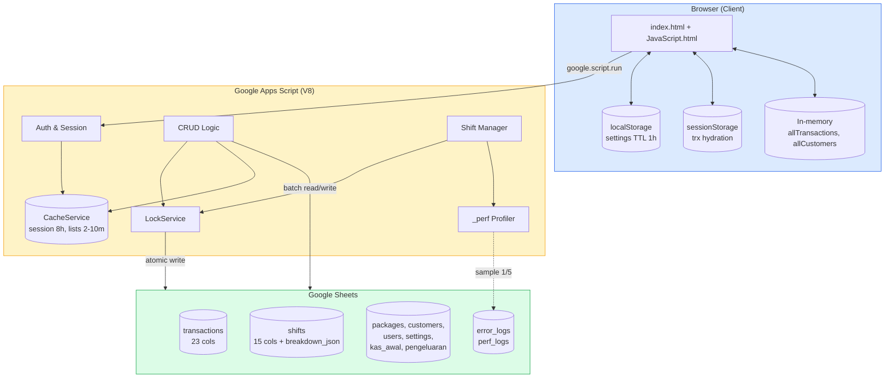
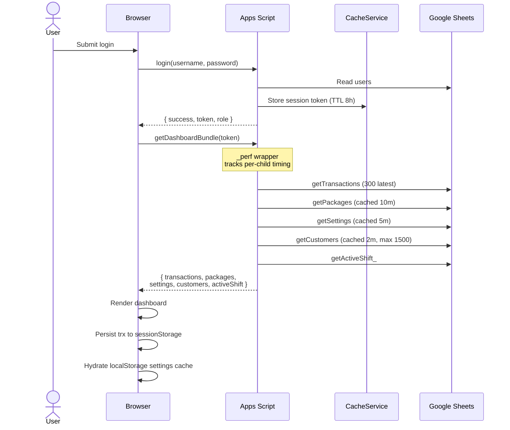
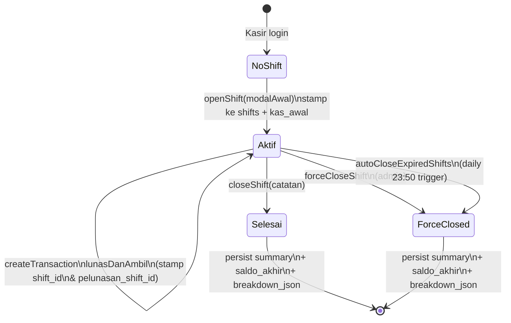
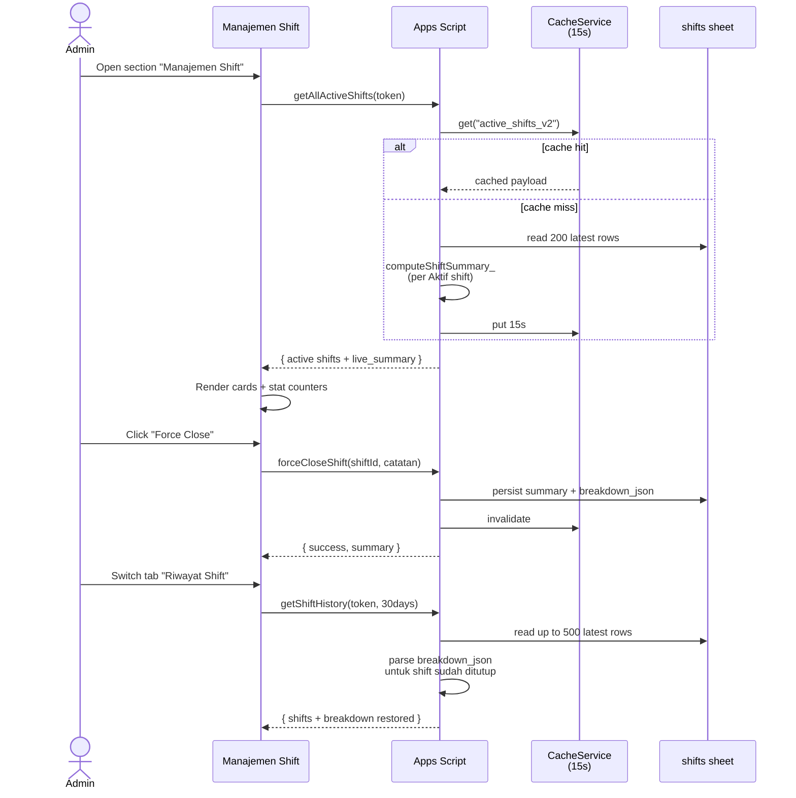
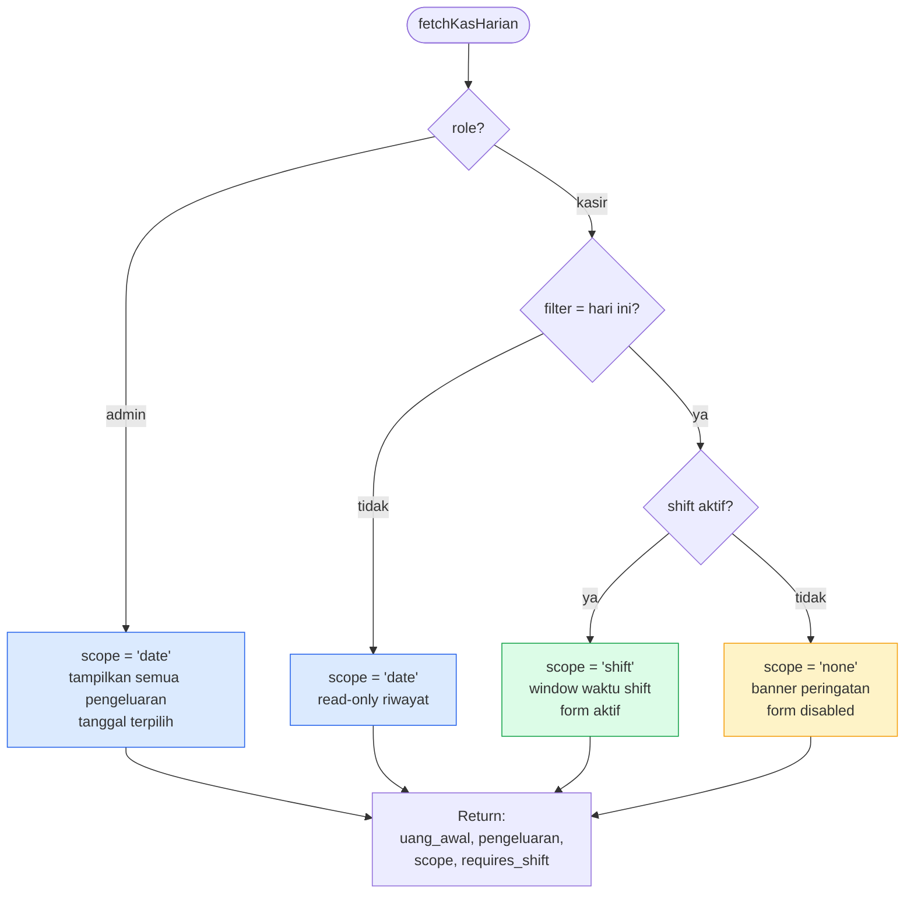

<div align="center">


# Kucucikan Laundry POS

### Cloud-Native Point of Sale untuk Bisnis Laundry Modern

_Sistem kasir profesional dengan shift management, profiling instrumentation, dan multi-layer caching — semua di atas Google Apps Script tanpa biaya hosting._

<br />

[](https://script.google.com/)
[](https://developer.mozilla.org/en-US/docs/Web/JavaScript)
[](https://tailwindcss.com/)
[](https://developer.mozilla.org/en-US/docs/Web/HTML)
[](https://sheets.google.com/)

<br />

[](#)
[](#-changelog)
[](#)
[](#)
[](#-license)
[](#-contributing)
[](#)

<br />

[Fitur](#-fitur-utama) ·
[Arsitektur](#-arsitektur--alur-data) ·
[Performance](#-performance--profiling) ·
[Skema DB](#-skema-database) ·
[Deploy](#-instalasi--deployment) ·
[Changelog](#-changelog)

</div>

---

## Daftar Isi

- [Tentang Proyek](#-tentang-proyek)
- [Fitur Utama](#-fitur-utama)
- [Tech Stack](#-tech-stack)
- [Arsitektur & Alur Data](#-arsitektur--alur-data)
- [Performance & Profiling](#-performance--profiling)
- [Skema Database](#-skema-database)
- [Instalasi & Deployment](#-instalasi--deployment)
- [Konfigurasi Pasca-Deploy](#-konfigurasi-pasca-deploy)
- [Workflow Pengembangan](#-workflow-pengembangan)
- [Kredensial Default](#-kredensial-default)
- [Roadmap](#-roadmap)
- [Changelog](#-changelog)
- [Contributing](#-contributing)
- [License](#-license)

---

## Tentang Proyek

**Kucucikan Laundry POS** adalah sistem kasir _end-to-end_ yang mengeliminasi
biaya infrastruktur dengan memanfaatkan ekosistem Google Workspace:

- **Google Sheets** sebagai database relasional
- **Google Apps Script (V8)** sebagai backend serverless
- **Web App URL** sebagai endpoint produksi yang dibagikan ke kasir/admin

Cocok untuk UMKM laundry dengan 1–3 kasir aktif yang membutuhkan POS profesional
tanpa biaya berlangganan bulanan, namun tetap menuntut akuntabilitas
(shift management, audit log, auto-backup) dan performa yang terukur
(profiling instrumentation, multi-layer caching, batch operations).

---

## Fitur Utama

<table>
<tr>
<td width="50%" valign="top">

### Manajemen Transaksi
- Kalkulasi otomatis tagihan, diskon, kembalian
- Pembayaran fleksibel: Tunai, Transfer, QRIS
- Sistem DP (Down Payment) dan pelunasan
- Multi-item per transaksi (kiloan + satuan)
- Auto-save draft tiap 5 detik (anti-crash browser)
- Cetak nota digital (thermal-ready)
- Konfirmasi WhatsApp dengan template kustom

### Manajemen Pelanggan
- CRUD pelanggan dengan WA ternormalisasi
- Riwayat & total spent per pelanggan
- Auto-suggest saat input transaksi baru
- Badge VIP otomatis untuk pelanggan loyal

### Manajemen Layanan
- Katalog dinamis (kiloan, satuan, kategori)
- Toggle aktif/nonaktif dengan optimistic UI
- Indikator popularitas paket
- Migration kolom otomatis

</td>
<td width="50%" valign="top">

### Shift Management
- Buka shift dengan modal awal kas (otomatis tersinkron ke Manajemen Kas)
- Tutup shift dengan rekap saldo akhir + **breakdown rinci**
  per metode (Tunai/QRIS/Transfer × DP/Pelunasan) dan per kategori
  pengeluaran (Bahan Baku/Operasional/Lain-lain)
- Atribusi pelunasan akurat antar shift
  (kolom `pelunasan_shift_id`)
- **Section "Manajemen Shift" admin-only** dengan tab Shift Aktif
  (live monitoring) & Riwayat Shift, plus stat cards real-time
- **Force-close** oleh admin untuk shift terbengkalai
- **Auto-close** trigger harian pukul 23:50
- Persisted summary + breakdown JSON (kolom 15) — admin bisa
  buka detail historis shift lama tanpa recompute
- Tombol "Hitung Detail" untuk lazy-migrasi shift pre-v2.3
- 15-detik cache pada `getAllActiveShifts` dengan auto-invalidate
  saat open/close/force-close
- Bypass otomatis untuk role admin di flow transaksi

### Dasbor Analitik
- Real-time omzet, antrean, target hari ini
- Multi-cashier sync (auto-refresh 1 menit)
- Pause polling saat tab background → resume on focus
- Tren pendapatan + chart layanan terlaris
- Export laporan CSV / PDF (lazy-loaded)
- **Manajemen Kas role-aware scope:**
  - Kasir + shift aktif → "Pengeluaran Shift Ini" (window waktu shift)
  - Kasir tanpa shift → form disabled + banner peringatan + tooltip
  - Admin → "Pengeluaran Hari Ini" (lintas shift)
  - Tanggal lalu → read-only riwayat
- **Card Total Penerimaan terhitung otomatis** (v2.6+):
  - Scope shift → akumulasi DP + pelunasan dalam window shift aktif
  - Scope date → DP berdasarkan tanggal transaksi + pelunasan
    berdasarkan `tanggal_pelunasan`
  - Subtitle realtime: `Tunai Rp X • Non-Tunai Rp Y`
  - Auto-refresh setelah `createTransaction` & `lunasDanAmbil`
- Banner edukatif "Uang Awal Otomatis" dari shift aktif
- Estimasi saldo real-time

### Manajemen Shift Admin (v2.3+)
- Section dedicated dengan tab Shift Aktif & Riwayat Shift
- 3 stat cards real-time: Shift Aktif Saat Ini, Total Modal Beredar,
  Penerimaan Live
- **Search & filter** di tab Riwayat (cari nama kasir, filter status)
- **Progressive disclosure** — card detail 2-layer:
  - Layer 1 (default): total per metode + total pengeluaran
  - Layer 2 ("Lihat Rincian Penuh"): DP/Pelunasan per metode +
    breakdown kategori pengeluaran
- Live monitoring per kasir dengan indicator pulse hijau
- Force-close shift dengan modal konfirmasi + catatan wajib
- 15-detik server cache + auto-invalidate

### Aksesibilitas (a11y)
- 9 modal dengan `role="dialog"` + `aria-modal` + `aria-labelledby`
- Decorative icon di-mark `aria-hidden="true"` agar screen reader skip
- WCAG AA contrast — semua label kecil pakai `text-slate-500`
- `aria-disabled` + `cursor: not-allowed` + tooltip pada form disabled
- Mobile bottom-nav dengan `aria-label` per tombol
- Focus management saat modal open/close

### Administrasi
- Manajemen pegawai (admin/kasir)
- Pengaturan toko (nama, logo, rekening)
- Template WhatsApp kustom dengan placeholder
- Auto-backup harian ke Google Drive
- Error logging silent ke sheet `error_logs`
- **Performance benchmark** built-in (`runPerfBenchmark`)

</td>
</tr>
</table>

---

## Tech Stack

| Layer | Teknologi |
|-------|-----------|
| **Backend** | Google Apps Script (V8 Runtime), JavaScript |
| **Database** | Google Sheets (8 sheet relasional) |
| **Frontend** | HTML5, JavaScript ES2020, Tailwind CSS v4.2.3 |
| **Charts** | ApexCharts (lazy-loaded) |
| **PDF Export** | jsPDF + jsPDF-AutoTable (lazy-loaded) |
| **Tooling** | clasp (CLI), npm, Tailwind CLI |
| **Hosting** | Google Workspace (Web App URL) |
| **Concurrency** | LockService |
| **Caching** | CacheService + sessionStorage + localStorage + RAM |
| **Profiling** | Custom `_perf` wrapper + sample log ke sheet |

---

## Arsitektur & Alur Data

### High-Level Architecture



### Login & Dashboard Bundle Flow



### Shift Lifecycle



### Admin Shift Management Flow (v2.3)



### Manajemen Kas Scope Resolution (v2.4)



---

## Performance & Profiling

### Pilar Optimasi

#### Performance
- **`getDashboardBundle`** — 1 RPC menggantikan 5 panggilan serial
  (transactions, packages, settings, customers, activeShift),
  hemat ~2–8 detik per login
- **Warmup trigger** — `setupWarmupTrigger` pasang time-based trigger
  setiap 5 menit yang menjaga V8 engine panas. Cold start 3–8s → ~500ms
- **Range-bounded reads** — semua hot path (`getCustomers`, `getKasHarian`,
  `computeShiftSummary_`, `getTransactions`) hanya membaca window
  yang relevan, bukan full sheet
- **Price map cache** — `createTransaction` lookup harga via cached
  map id→harga (memory + CacheService 5m), hemat 200–400ms per transaksi
- **Batch sheet writes** — `setValues([rows])` menggantikan multiple
  `setValue()`, percepat tulis 400–600%
- **Persisted shift summary** — sheet `shifts` menyimpan
  `total_pengeluaran`, `saldo_akhir`, dan **`breakdown_json`** (kolom 15)
  saat close, jadi `getShiftHistory` tidak recompute untuk shift
  yang sudah ditutup
- **Active shifts cache 15s** — `getAllActiveShifts` hasil di-cache
  CacheService 15 detik dengan auto-invalidate hooks pada
  open/close/forceClose; aman untuk monitoring polling agresif
- **Lazy migration** — endpoint `recomputeShiftBreakdown` admin-only
  untuk menghitung & persist breakdown shift lama on-demand
- **Lazy-load** ApexCharts (~250KB) + jsPDF (~150KB) hanya saat tab
  Laporan pertama dibuka, hemat ~400KB pada initial load
- **4-layer caching:**
  - **Server CacheService** — sesi (8h), customers (2m), packages (10m),
    price map (5m), settings (5m)
  - **Memory cache** — price map per execution
  - **Client RAM** — transactions (1m), customers (2m)
  - **Persistent client** — sessionStorage (trx hydration),
    localStorage (settings 1h)
- **Smart polling** — auto-refresh pause saat
  `document.visibilityState === "hidden"`, resume on visibility change

#### Profiling Built-In
Sistem hadir dengan instrumentasi siap pakai untuk diagnosa lambatnya
request tanpa perlu DevTools eksternal:

```js
// Server-side: jalankan dari Apps Script Editor (admin only)
runPerfBenchmark(token)
// → mengembalikan map { fnName: { ms, ok, size } } untuk semua hot path

// Client-side: dari DevTools console
perfStats()    // tabel p50/p95/max/avg per fungsi
perfClear()    // reset log

// Disable saat tidak diperlukan
disablePerfLogging()           // server (PropertiesService flag)
window.PERF_OFF = true         // client
```

Server `_perf()` otomatis log ke `console.log()` (visible di Stackdriver
Executions) dan sample 1 dari 5 call ke sheet `perf_logs` untuk audit.

#### Reliability
- **LockService** di semua write kritis (createTransaction,
  lunasDanAmbil, openShift, closeShift, forceCloseShift,
  autoCloseExpiredShifts)
- **Defensive setupDashboard** dengan per-blok try/catch — dashboard
  tetap muncul walau ada satu fungsi error
- **Silent error logging** ke sheet `error_logs` untuk audit
  pasca-insiden
- **Auto-backup harian** ke Drive pukul 02:00
- **Auto-close shift harian** pukul 23:50 sebagai fail-safe

#### Security
- **Token-based session** dengan UUID, TTL 8 jam, rolling refresh
- **Salted hash password** dengan auto-migrasi format lama saat login
- **Login rate limit** — 5 percobaan gagal mengunci 15 menit
- **Admin-only guards** via `validateAdminSession_()` di endpoint
  sensitif (`deleteTransaction`, `forceCloseShift`, `getShiftHistory`,
  `getAllActiveShifts`, `recomputeShiftBreakdown`, `getUsersList`,
  `runPerfBenchmark`)
- **DB_ID** di Script Properties (bukan hardcoded) dengan auto-migrasi
- **Server-side trust** — total, diskon, status divalidasi ulang di
  server, mencegah manipulasi DevTools

#### Maintainability
- **LF-only line endings** dipaksa via `.gitattributes` — mencegah
  parser GAS pecah saat menerima CRLF dalam inline `<script>`
- **`.claspignore`** mengecualikan file debug & temp dari deployment
- **Modular helpers** — `computeShiftSummary_()`, `getPackagePriceMap_()`,
  `_perf()`, `setBtnLoading()`, `renderListSkeleton()`, `applyKasScope()`
  dipakai lintas hot path
- **Migration scripts** — `setupDatabase()` idempoten dengan auto-add
  kolom baru tanpa data loss

---

## Skema Database

Sheet otomatis dibuat & dimigrasi oleh `setupDatabase()`. Klik untuk
expand detail kolom.

<details>
<summary><b>Sheet: <code>users</code></b></summary>

| Kolom | Tipe | Keterangan |
|-------|------|------------|
| username | string | Primary key (case-insensitive) |
| password | string | Salted hash format `salt:hash` |
| role | enum | `admin` / `kasir` |
| nama | string | Display name |

</details>

<details>
<summary><b>Sheet: <code>packages</code></b></summary>

| Kolom | Tipe | Keterangan |
|-------|------|------------|
| id | UUID | Primary key |
| nama_paket | string | Nama layanan |
| harga | int | Tarif per satuan |
| durasi_hari | int | Estimasi proses (hari) |
| satuan | string | Kg / Pcs / Set |
| kategori | string | Tag pengelompokan |
| status | enum | `Aktif` / `Nonaktif` |

</details>

<details>
<summary><b>Sheet: <code>transactions</code> (23 kolom)</b></summary>

| # | Kolom | Tipe | Keterangan |
|---|-------|------|------------|
| 1 | id | UUID | Primary key |
| 2 | tanggal | ISO datetime | Waktu input transaksi |
| 3 | customer | string | Nama pelanggan |
| 4 | paket | string | Layanan utama (legacy single-item) |
| 5 | berat | float | Berat total (legacy) |
| 6 | total | int | Grand total |
| 7 | status | enum | `Proses`/`Selesai`/`Diambil` |
| 8 | kasir | string | Username kasir yang menginput |
| 9 | whatsapp | string | Nomor WA pelanggan |
| 10 | satuan | string | Satuan default |
| 11 | estimasi_selesai | ISO datetime | Target selesai |
| 12 | metode_pembayaran | string | Tunai/Transfer/QRIS |
| 13 | status_pembayaran | enum | `Lunas`/`Belum Lunas` |
| 14 | metode_pelunasan | string | Diisi saat pelunasan |
| 15 | _(reserved)_ | — | — |
| 16 | catatan | string | Catatan kasir |
| 17 | terbayar | int | Akumulasi pembayaran |
| 18 | items_json | JSON | Multi-item array |
| 19 | tanggal_pelunasan | ISO datetime | Waktu pelunasan |
| 20 | nominal_dp | int | Down payment |
| 21 | nominal_pelunasan | int | Sisa pelunasan |
| 22 | **shift_id** | UUID | FK → shifts.id (saat dibuat) |
| 23 | **pelunasan_shift_id** | UUID | FK → shifts.id (saat dilunasi) |

</details>

<details>
<summary><b>Sheet: <code>shifts</code> (15 kolom)</b></summary>

| # | Kolom | Tipe | Keterangan |
|---|-------|------|------------|
| 1 | id | UUID | Primary key |
| 2 | kasir | string | Username |
| 3 | nama_kasir | string | Display name |
| 4 | waktu_mulai | ISO datetime | Buka shift |
| 5 | waktu_selesai | ISO datetime | Tutup shift |
| 6 | modal_awal | int | Kas awal saat buka |
| 7 | total_transaksi | int | Total nilai trx (persisted) |
| 8 | total_tunai | int | Tunai diterima (persisted) |
| 9 | total_non_tunai | int | Non-tunai diterima (persisted) |
| 10 | jumlah_order | int | Hitung order (persisted) |
| 11 | status | enum | `Aktif`/`Selesai`/`Force-Closed` |
| 12 | catatan | string | Catatan tutup shift |
| 13 | total_pengeluaran | int | Pengeluaran shift (persisted) |
| 14 | saldo_akhir | int | modal + tunai − pengeluaran |
| 15 | **breakdown_json** | JSON | Breakdown rinci per metode (Tunai/QRIS/Transfer × DP/Pelunasan) & per kategori pengeluaran (persisted v2.3+) |

Format `breakdown_json`:
```json
{
  "breakdownMetode": {
    "Tunai":    { "dp": 50000, "pelunasan": 30000, "total": 80000, "count": 3 },
    "QRIS":     { "dp": 0,     "pelunasan": 0,     "total": 0,     "count": 0 },
    "Transfer": { "dp": 0,     "pelunasan": 0,     "total": 0,     "count": 0 },
    "Lainnya":  { "dp": 0,     "pelunasan": 0,     "total": 0,     "count": 0 }
  },
  "breakdownPengeluaran": {
    "Bahan Baku":  { "jumlah": 12000, "count": 1 },
    "Operasional": { "jumlah": 0,     "count": 0 },
    "Lain-lain":   { "jumlah": 0,     "count": 0 }
  },
  "totalDp": 50000,
  "totalPelunasan": 30000
}
```

</details>

<details>
<summary><b>Sheet pendukung lainnya</b></summary>

- **`settings`** — `key`, `value` (config aplikasi)
- **`customers`** — `id`, `nama`, `whatsapp`, `terakhir_order`
- **`kas_awal`** — `tanggal`, `nominal`, `kasir`
- **`pengeluaran`** — `id`, `tanggal`, `keterangan`, `kategori`,
  `jumlah`, `kasir`
- **`error_logs`** — `Waktu`, `Fungsi`, `Pesan`, `Context`
  (auto-rotate 500 row)
- **`perf_logs`** — `timestamp`, `fn`, `ms`, `ok`
  (auto-rotate 1000 row)

</details>

---

## Instalasi & Deployment

### Prasyarat

- [Node.js](https://nodejs.org/) ≥ 18.x dan npm
- Akun Google dengan akses Apps Script
- _(Opsional)_ Tailwind CLI untuk rebuild CSS

### Quick Start

```bash
# 1. Clone repository
git clone https://github.com/nndda-rzn/kucucikan-laundry-gas.git
cd kucucikan-laundry-gas

# 2. Install clasp global
npm install -g @google/clasp

# 3. Login ke Google
clasp login

# 4a. Hubungkan ke project Apps Script existing
clasp clone <YOUR_SCRIPT_ID>

# 4b. ATAU buat project baru
clasp create --type webapp --title "Kucucikan Laundry POS"

# 5. Push source ke server
clasp push

# 6. Buat versi deployment baru (WAJIB untuk URL /exec)
clasp deploy
```

### Build Tailwind (Opsional)

```bash
npm install -D @tailwindcss/cli
node build-tailwind.js
clasp push
```

---

## Konfigurasi Pasca-Deploy

Buka editor (`clasp open`) lalu jalankan fungsi berikut **satu kali**:

| Function | Tujuan | Frekuensi |
|----------|--------|-----------|
| `setupDatabase` | Inisialisasi sheet & migrasi kolom (idempoten) | Sekali |
| `setupAllTriggers` | Pasang warmup + auto-close shift + auto-backup | Sekali |
| _(opsional)_ `runPerfBenchmark` | Diagnose latency hot paths | On-demand |

> **Pertama kali Run** akan meminta authorization Google untuk akses
> Sheets, Drive, dan ScriptApp triggers. Klik _Review permissions_ →
> pilih akun → _Allow_.

### Trigger yang Terpasang oleh `setupAllTriggers`

| Trigger | Frekuensi | Fungsi |
|---------|-----------|--------|
| `warmup` | Tiap 5 menit | Cegah V8 cold start |
| `autoCloseExpiredShifts` | Harian 23:50 | Tutup shift terbengkalai |
| `dailyBackup` | Harian 02:00 | Duplikasi DB ke Drive |

---

## Workflow Pengembangan

```bash
# Edit file lokal di IDE favorit
code .

# Sync ke GAS
clasp push

# Buat versi deployment baru (untuk URL /exec)
clasp deploy

# Atau test di /dev URL — selalu pakai HEAD terbaru tanpa versioning
clasp open
# → Deploy → Test deployments → ambil URL
```

> **Penting:** `clasp push` saja **tidak** akan meng-update URL `/exec`
> production — versi deployment baru harus dibuat agar GAS menyajikan
> kode terbaru. Gunakan `/dev` URL untuk iterasi cepat saat development.

### Profiling Saat Investigasi Lambat

```bash
# Server-side: jalankan dari editor
runPerfBenchmark   # admin token diperlukan

# Atau cek log Executions:
# Apps Script Editor → Executions → filter "PERF"
# → akan tampil [PERF][getDashboardBundle] 1234ms beserta child timings

# Cek sheet perf_logs untuk sample histori
# (1 dari 5 call disimpan, auto-rotate 1000 row)
```

```js
// Client-side: DevTools console
perfStats()    // p50/p95/max per RPC
perfClear()    // reset
```

---

## Kredensial Default

Setelah `setupDatabase()` pertama kali dijalankan:

| Username | Password | Role |
|----------|----------|------|
| `admin` | `admin123` | admin |
| `kasir` | `kasir123` | kasir |

> **Wajib ganti password** setelah login pertama via menu
> **Manajemen Pegawai**.

---

## Roadmap

- [ ] Multi-cabang (multi-spreadsheet sync)
- [ ] Real-time push via Apps Script Sheets API webhook
- [ ] Loyalty point & redemption system
- [ ] Integrasi payment gateway (Midtrans/Xendit) untuk QRIS dinamis
- [ ] Mobile-first PWA dengan offline mode
- [ ] Multi-bahasa (EN/ID)
- [ ] Audit trail per transaksi (siapa edit kapan)
- [ ] Pre-aggregated daily stats sheet untuk dashboard instant
- [ ] Service worker caching untuk static asset
- [ ] Bulk migration command untuk semua shift legacy ke breakdown_json
- [ ] Export PDF/Excel rekap shift per kasir & per periode

---

## Changelog

### v2.6 — Total Penerimaan Card _(2026-05)_
**Resolves:** Card "Total Penerimaan Hari Ini (Estimasi)" hardcoded
Rp 0 sejak v2.0 (komentar dev: "biarkan kosong, isi nanti via dashboard
update"). Client lapor transaksi & pelunasan yang sudah dikerjakan
tidak ke-rekap di card.

**Backend `getKasHarian` tambahan field:**
- `total_penerimaan` — grand total Tunai + Non-Tunai (DP & Pelunasan)
- `penerimaan_tunai`, `penerimaan_non_tunai` — breakdown per metode
- `penerimaan_dp`, `penerimaan_pelunasan` — breakdown per jenis

**Logika scope-aware:**
- `shift` → reuse `computeShiftSummary_` (akurat per window shift,
  termasuk attribusi `pelunasan_shift_id`)
- `date` → scan `transactions` 1000 row terakhir, agregat DP berdasarkan
  tanggal transaksi (kolom 1) + pelunasan berdasarkan `tanggal_pelunasan`
  (kolom 18)
- `none` → tetap 0 dengan label "Penerimaan Shift Ini"

**Frontend:**
- Card `kasPenerimaan` render dari `res.total_penerimaan`
- Label dinamis: "Penerimaan Shift Ini" / "Penerimaan Hari Ini" /
  "Penerimaan Hari Ini (Riwayat)" sesuai role + scope
- Subtitle realtime: `Tunai Rp X • Non-Tunai Rp Y`
- Helper `refreshKasIfVisible()` dipanggil setelah `createTransaction`
  & `lunasDanAmbil` agar card sinkron tanpa refresh manual

### v2.5 — UX/A11y Polish _(2026-05)_
**P0 — Accessibility & Critical UX**
- 4 modal shift (open/close/force-close/summary) tambah `role="dialog"`
  + `aria-modal="true"` + `aria-labelledby` + `aria-describedby`;
  decorative icon di-mark `aria-hidden="true"`
- Bulk replace 50 occurrence `text-slate-400` di label kecil
  (`text-[9px]`/`text-[10px]`) → `text-slate-500` untuk WCAG AA
  (kontras 3.06:1 → 4.6:1)
- Form pengeluaran disabled state kini punya `cursor: not-allowed` +
  `title` tooltip + `aria-disabled` saat scope `none` atau read-only
- **Default landing role-aware**: kasir login → langsung section Transaksi
  (80% workflow kasir di sini, hemat 1 klik); admin tetap Overview

**P1 — Friction Reduction**
- Tab Riwayat Shift admin tambah toolbar **search & filter**:
  - Search nama kasir (live filter)
  - Select status (Semua/Aktif/Selesai/Force-Closed)
  - Counter "X dari Y shift" realtime
  - Empty state dengan icon search untuk hasil kosong
- **Progressive disclosure** card detail shift jadi 2-layer:
  - Layer 1 default: total per metode (Tunai/QRIS/Transfer) + total
    pengeluaran ringkas
  - Layer 2 "Lihat Rincian Penuh" (collapsed): DP/Pelunasan per metode +
    breakdown kategori pengeluaran
  - Mengurangi visual overload dari 7 element → 4 element pada expand pertama
  - Konsisten antara tab Aktif & Riwayat
- **Loading state helpers terpadu**:
  - `setBtnLoading(btn, loading, label)` — spinner SVG + `aria-busy` +
    preserve original innerHTML via dataset (auto-restore tanpa state bug)
  - `renderListSkeleton(target, count)` — skeleton card terstandar untuk
    list views dengan `aria-busy` + `aria-hidden` pada decoratif
  - Apply ke executeOpenShift, executeCloseShift, executeForceCloseShift,
    loadShiftAdminTab, loadShiftRekap

### v2.4 — Role-Aware Cash Management _(2026-05)_
- `getKasHarian` mengembalikan **scope** per request:
  - `shift` — kasir hari ini dengan shift aktif → window waktu shift
    (mulai → now); konsisten dengan rekap closeShift
  - `date` — admin atau kasir lihat tanggal lalu → semua pengeluaran
    pada tanggal itu (lintas shift kasir)
  - `none` — kasir hari ini tanpa shift aktif → kosong + flag
    `requires_shift` untuk UI banner
- Frontend `applyKasScope`:
  - Label dinamis "Pengeluaran Shift Ini" / "Pengeluaran Hari Ini" /
    "Pengeluaran Hari Ini (Riwayat)"
  - Banner peringatan + form disabled saat scope `none`
  - Read-only mode kasir saat lihat tanggal lalu
- Auto-refresh section Manajemen Kas saat `openShift` / `closeShift` —
  scope visual reset ke 0 tanpa kehilangan data DB
- Single source of truth (sheet `pengeluaran` tetap append-only),
  yang berubah hanya **query scope** sesuai konteks user

### v2.3 — Admin Shift Management & Detailed Bookkeeping _(2026-05)_
- Section baru **"Manajemen Shift"** admin-only dengan tab Shift Aktif
  (live monitoring) & Riwayat Shift, plus 3 stat cards real-time
- Hapus form duplikat **"Input Uang Awal"** di Manajemen Kas;
  modal awal otomatis tersinkron dari `openShift()`
- Backend `getAllActiveShifts()` dengan cache 15 detik dan
  auto-invalidate hooks (open/close/forceClose/autoClose)
- `computeShiftSummary_` mengembalikan **breakdownMetode**
  (Tunai/QRIS/Transfer × DP/Pelunasan) dan
  **breakdownPengeluaran** per kategori
- Persist `breakdown_json` (kolom 15) saat close/forceClose/autoClose
  — admin bisa lihat detail historis tanpa recompute
- `getShiftHistory` restore breakdown dari JSON; range-bounded ke
  500 row terakhir
- Endpoint `recomputeShiftBreakdown` admin-only untuk lazy migration
  shift pre-v2.3 (tombol "Hitung Detail" di card Riwayat)
- Modal **Shift Selesai** kini menampilkan rincian per metode + per
  kategori pengeluaran + saldo akhir highlight
- Admin cards expand/collapse "Detail" dengan breakdown lengkap

### v2.2 — Performance & Profiling _(2026-05)_
- Profiling instrumentation (`_perf` wrapper, `runPerfBenchmark`,
  client `perfStats`)
- Warmup trigger 5-menit (cold start 3–8s → ~500ms)
- Range-bounded reads di `getCustomers`, `getKasHarian`,
  `computeShiftSummary_`, `getTransactions`
- Price map cache untuk `createTransaction` (hemat 200–400ms/trx)
- Smart polling pause saat tab hidden, resume on visibility change
- Persisted shift summary (`total_pengeluaran`, `saldo_akhir`) —
  `getShiftHistory` tidak recompute untuk shift Selesai/Force-Closed
- sessionStorage hydration untuk transactions agar Ctrl+Shift+R
  tidak blank dashboard
- `setupAllTriggers()` convenience untuk pasang semua trigger sekaligus

### v2.1 — Shift Management _(2026-05)_
- Fitur shift kasir lengkap: open · close · force-close · auto-close
- Atribusi pelunasan via kolom `pelunasan_shift_id` (kolom 23)
- Tab Rekap Shift di halaman Laporan admin dengan force-close action
- Modal rekap saldo akhir saat tutup shift
- Auto-close trigger harian 23:50 sebagai fail-safe
- Bypass shift untuk role admin
- LF-only line endings dipaksa via `.gitattributes`
- Defensive `setupDashboard` per-blok try/catch

### v2.0 — Performance Wave _(2026-05)_
- `getDashboardBundle` — 1 GAS call menggantikan 4 panggilan
- Lazy-load ApexCharts & jsPDF
- 3-layer caching strategy
- Date-bounding query (300 transaksi terbaru)
- Optimistic UI untuk toggle status paket
- Batch sheet operations (setValues)

### v1.x — Foundation
- Daily cash management (kas awal & pengeluaran)
- User management dengan role-based access
- WhatsApp integration & template kustom
- Auto-save draft transaksi
- LockService di semua write operations
- Auto-backup harian ke Drive
- UI overhaul ke Tailwind v4

---

## Contributing

Kontribusi terbuka untuk siapa saja yang ingin meningkatkan sistem ini.

```bash
# Fork & clone
git clone https://github.com/<your-username>/kucucikan-laundry-gas.git
cd kucucikan-laundry-gas

# Buat branch fitur
git checkout -b feat/nama-fitur

# Edit, test via clasp push, commit
git commit -m "feat: deskripsi singkat"

# Push & buka Pull Request
git push origin feat/nama-fitur
```

### Konvensi Commit

Mengikuti [Conventional Commits](https://www.conventionalcommits.org/):

| Prefix | Penggunaan |
|--------|------------|
| `feat:` | Fitur baru |
| `fix:` | Bug fix |
| `perf:` | Optimasi performa |
| `refactor:` | Refactor tanpa perubahan behavior |
| `docs:` | Update dokumentasi |
| `chore:` | Tooling, deps, config |
| `style:` | Formatting, whitespace |
| `test:` | Test additions |

### Code Style

- LF line endings (dipaksa oleh `.gitattributes`)
- Indentasi 2 spasi
- Naming: `camelCase` untuk function/variable, `_suffix` untuk private
  helpers (mis. `getActiveShift_`, `computeShiftSummary_`)
- File HTML digenerate via `clasp` — jangan edit langsung di production
- Test perubahan dengan `clasp push` ke `/dev` URL sebelum deploy
  versi baru

---

## License

Proyek ini dirilis di bawah [MIT License](LICENSE).

---

<div align="center">

**Kucucikan Laundry POS**

_Built with care for laundry operations that demand speed, accuracy, and accountability._

<sub>Made with Apps Script · Deployed on Google Workspace · Zero infrastructure cost</sub>

[⬆ Kembali ke atas](#kucucikan-laundry-pos)

</div>
